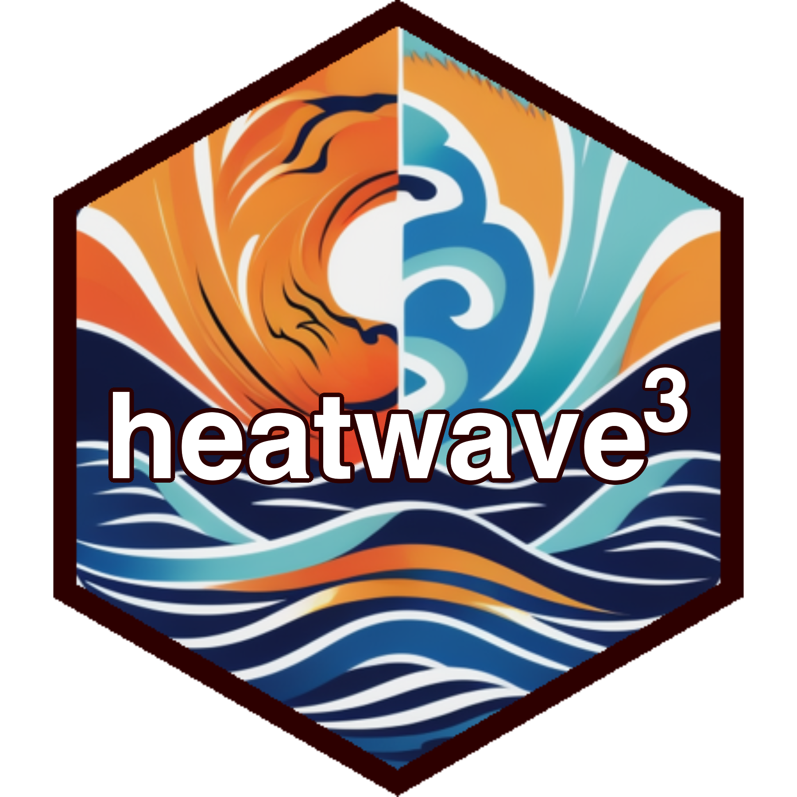

# heatwave3 

<!-- badges: start -->
[](https://github.com/robwschlegel/heatwave3/actions/workflows/R-CMD-check.yaml)
[](https://app.codecov.io/gh/robwschlegel/heatwave3?branch=main)
<!-- badges: end -->

Welcome to __`heatwave3`__. The goal of this package is to improve on the serial application of the Hobday et al. 2016, 2018 marine heatwave (MHW) definition on time series data. Traditionally we have had to detect MHW within one time series at a time. For large gridded datasets this can be a technically difficult and time consuming process. Now, thanks to developments in the __`terra`__ package it is possible to apply any numbers of functions directly to gridded data (e.g. NetCDF files). __`heatwave3`__ therefore serves as an extension to the [__`heatwaveR`__](https://robwschlegel.github.io/heatwaveR/index.html) package and helps the user to easily and quickly detect MHWs within their gridded dataset. It can output the results as a raster, NetCDF, or CSV file.

The package is still in its infancy and is being actively developed. Any and all feedback is very welcome!

## Installation

You can install the development version of heatwave3 from [GitHub](https://github.com/) with:

``` r
# install.packages("devtools")
devtools::install_github("robwschlegel/heatwave3")
```

## Example

The use of __`heatwave3`__ has been designed to be as easy ass possible. There is a lot happening behind the scenes that allows this package to determine the structure of the users data without needing to provide any additional arguments. Please see the following example:

``` r
library(heatwave3)

# Set a file pathway
mhw_cube <- detect3(file_in = system.file("extdata/oisst_short.nc", package = "heatwave3"),
               return_type = "df")
# Show the first few rows
head(mhw_cube)
```

Of course, there are possibly more ways to organise a data file than there are stars in the sky. If this function doesn't work on your dataset, please contact us! We are actively looking for ways to improve the usability of __`heatwave3'__

## Code of Conduct

Please note that the heatwave3 project is released with a [Contributor Code of Conduct](https://contributor-covenant.org/version/2/1/CODE_OF_CONDUCT.html). By contributing to this project, you agree to abide by its terms.

