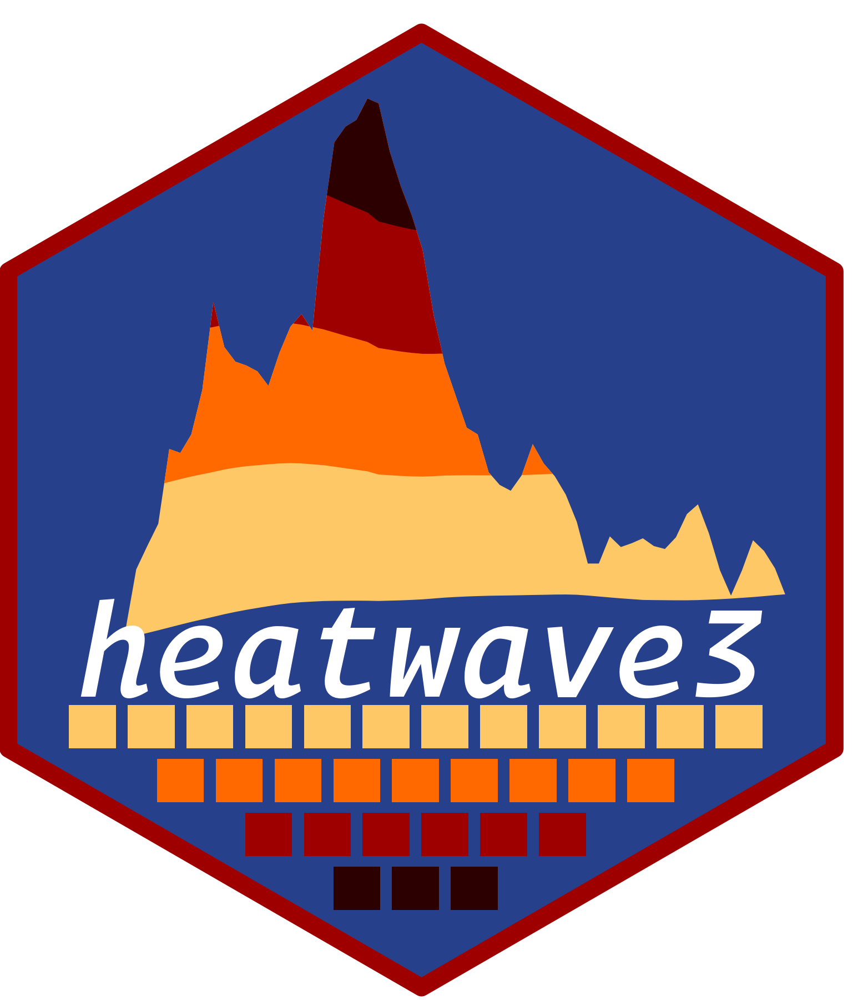

# heatwave3 

<!-- badges: start -->
[](https://github.com/robwschlegel/heatwave3/actions/workflows/R-CMD-check.yaml)
[](https://app.codecov.io/gh/robwschlegel/heatwave3?branch=main)
<!-- badges: end -->

**heatwave3** detects marine heatwaves (MHWs) and cold-spells directly on gridded NetCDF data using the Hobday et al. (2016, 2018) definition. It is a ground-up C++ reimplementation of [**heatwaveR**](https://robwschlegel.github.io/heatwaveR/), designed for gridded datasets rather than individual time series.

## Why heatwave3?

Working with large gridded SST datasets (e.g. OSTIA, OISST, ERA5, CMIP6) using heatwaveR requires looping over each pixel individually in R. For a 400 &times; 200 grid with 40 years of daily data, this takes over an hour. **heatwave3** solves this by:

1. **C++17 implementation** of all core algorithms (climatology, event detection, blob labelling)
2. **OpenMP parallelism** across pixels &mdash; each pixel is independent
3. **Direct NetCDF I/O** via libnetcdf &mdash; no R NetCDF packages needed at runtime

### Performance

Benchmarked on the OSTIA South-West Indian Ocean reanalysis (400 &times; 200 grid, ~50,000 ocean pixels, 14,276 daily time steps), Apple M3 Pro:

| Method | Time | Speedup |
|--------|------|---------|
| heatwaveR (serial) | ~69 min | 1&times; |
| heatwave3 (1 thread) | 4.3 min | **16&times;** |
| heatwave3 (12 threads) | 1.9 min | **36&times;** |

For larger grids using daily files (Benguela region, 260 &times; 360 pixels, 16,049 daily OSTIA files, 12 threads): **3.4 minutes** end-to-end.

## Features

- **Climatology** (`ts2clm3`) &mdash; sliding-window percentile with Type-7 quantile, circular-padded rolling mean smoothing, optional linear detrending (Jacox et al. 2020)
- **Event detection** (`detect_event3`) &mdash; threshold exceedance, run-length encoding, gap joining, 19 event metrics. Cold-spell support.
- **Spatial blob detection** (`detect_blob3`) &mdash; 3D connected-component labelling with voxel-level footprint output
- **Event categorisation** (`category3`) &mdash; Hobday et al. (2018) Moderate/Strong/Severe/Extreme categories
- **Yearly aggregation** (`block_average3`) and **static threshold exceedance** (`exceedance3`)
- **Plotting** &mdash; `event_line3`, `geom_flame3`, `geom_lolli3`, `plot_metric3`
- **Flexible input** &mdash; single multi-timestep NetCDF, directory of daily files, or explicit file vector
- **Robust dimension detection** &mdash; auto-detects lon/lat/time/SST from CF attributes, standard names, and units (works with GHRSST, OISST, OSTIA, ERA5, CMIP6, NEMO)
- **Multiple output formats** &mdash; NetCDF (always), plus optional CSV, RDA, or Parquet companion files
- **Numerical equivalence** &mdash; climatology and event metrics match heatwaveR to rounding precision (validated pixel-by-pixel)

## Installation

### Development version (recommended)

The `dev` branch contains the new C++ implementation:

```r
# install.packages("remotes")
remotes::install_github("robwschlegel/heatwave3@dev")
```

### System requirements

heatwave3 requires the **netCDF C library** (version 4.0+). The `configure` script finds it automatically via `nc-config` or `pkg-config`.

**macOS:**
```bash
brew install netcdf
```

**Ubuntu / Debian:**
```bash
sudo apt install libnetcdf-dev
```

**Fedora / RHEL:**
```bash
sudo dnf install netcdf-devel
```

### Enabling OpenMP on macOS (optional)

On Linux, OpenMP parallelism works out of the box. On macOS, it is disabled by default because R ships an older `libomp` that conflicts with Homebrew's version. To enable multi-threaded execution on macOS:

```bash
brew install libomp
```

Then create or edit `~/.R/Makevars`:

```makefile
SHLIB_OPENMP_CXXFLAGS = -Xclang -fopenmp
```

Reinstall heatwave3 after making this change. If you encounter `Symbol not found: ___kmpc_dispatch_deinit` errors, remove the `SHLIB_OPENMP_CXXFLAGS` line &mdash; the package works correctly in single-threaded mode.

## Quick start

```r
library(heatwave3)

sst_file <- "path/to/sst.nc"  # or a directory of daily files
clim_file <- tempfile(fileext = ".nc")
event_file <- tempfile(fileext = ".nc")

# All-in-one: climatology + event detection
detect3(
  file_in         = sst_file,
  file_out_clim   = clim_file,
  file_out_event  = event_file,
  climatologyPeriod = c("1991-01-01", "2020-12-31"),
  lon_range       = c(15, 35),
  lat_range       = c(-38, -28),
  n_threads       = 4
)

# Per-pixel time series plot
event_line3(sst_file, clim_file, lon = 25.0, lat = -34.0,
            start_date = "2018-01-01", end_date = "2019-12-31")

# Spatial map of peak intensity
plot_metric3(event_file, metric = "intensity_max", summary = "mean")

# Event categories
cats <- category3(event_file, clim_file)
table(cats$category)
```

### Using daily files

```r
# Pass a directory — all .nc/.nc4 files are read, sorted, and merged
ts2clm3(
  file_in = "/path/to/daily_ostia/",
  file_out = clim_file,
  climatologyPeriod = c("1991-01-01", "2020-12-31"),
  n_threads = 12
)
```

### Spatial blob detection

```r
blobs <- detect_blob3(
  sst_file  = sst_file,
  clim_file = clim_file,
  minVoxels = 200,
  topN      = 6,
  return    = c("event", "daily", "voxel")
)

# blobs$event  — summary per blob (duration, peak area, cumulative intensity)
# blobs$daily  — daily progression (area, centroid, bounding box)
# blobs$voxel  — full 3D footprint (for spatial maps)
```

### Detrended climatology

```r
# Remove linear warming trend before computing climatology
# (Jacox et al. 2020 approach)
ts2clm3(sst_file, clim_file,
        climatologyPeriod = c("1991-01-01", "2020-12-31"),
        detrend = TRUE)
```

## API overview

All functions are suffixed with `3` to avoid namespace conflicts with heatwaveR:

| Function | Purpose |
|----------|---------|
| `ts2clm3()` | Compute climatology (NetCDF &rarr; NetCDF) |
| `detect_event3()` | Detect per-pixel events |
| `detect3()` | All-in-one convenience wrapper |
| `detect_blob3()` | 3D spatial blob detection |
| `category3()` | Hobday et al. (2018) event categories |
| `block_average3()` | Yearly aggregation of event metrics |
| `exceedance3()` | Static threshold exceedance |
| `event_line3()` | Per-pixel time series plot |
| `geom_flame3()` | ggplot2 flame polygon geom |
| `geom_lolli3()` | ggplot2 lollipop geom |
| `plot_metric3()` | Spatial map of event metrics |
| `hw3_export()` | Export NetCDF output to CSV/RDA/Parquet |

## Vignettes

- **Getting started** &mdash; full pipeline walkthrough with spatial blob figures
- **NetCDF output internals** &mdash; output file structure, CF compliance, reading in R/Python/CDO
- **Performance benchmark** &mdash; heatwaveR vs heatwave3 timing comparison

## Citation

If you use heatwave3 in published research, please cite both:

- Hobday, A.J., et al. (2016). A hierarchical approach to defining marine heatwaves. *Progress in Oceanography*, 141, 227&ndash;238.
- Hobday, A.J., et al. (2018). Categorizing and naming marine heatwaves. *Oceanography*, 31(2), 162&ndash;173.

## Code of Conduct

Please note that the heatwave3 project is released with a [Contributor Code of Conduct](https://contributor-covenant.org/version/2/1/CODE_OF_CONDUCT.html). By contributing to this project, you agree to abide by its terms.
