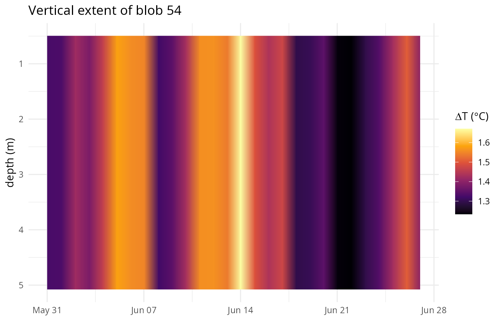
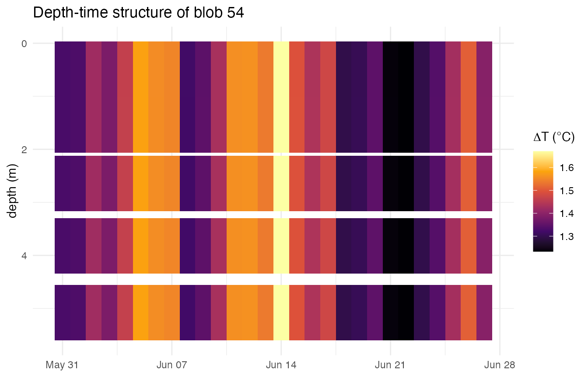

<div id="main" class="col-md-9" role="main">

# 4D blob connectivity: heatwaves through the water column

<div class="section level2">

## Overview

`detect_blob3()` finds spatially contiguous marine heatwave “blobs” by
connected-component labelling of the daily exceedance mask. Given a
depth-resolved climatology (from `ts2clm3(depth_range = ...)`, see
`vignette("depth-range")`), it now does this natively in 4D: a voxel
connects to its neighbours in longitude, latitude, depth, *and* time,
instead of just the first three. No new argument is needed – exactly
like `detect_event3()` and `category_daily3()`, `detect_blob3()` reads
the depth range straight off `clim_file` and switches to 4D connectivity
automatically.

**Connectivity is by depth *index*, not a depth *range*.** A voxel
connects to whichever level is immediately above or below it – level 3
to level 4, say – regardless of how many metres apart those levels
actually are. There is no minimum/maximum vertical gap or distance
threshold: two voxels one level apart always connect if both exceed the
threshold that day; two voxels separated by an empty level in between
never do, however close together in metres those levels happen to be.
This mirrors exactly how the existing lon/lat/time connectivity already
works (adjacent index, not adjacent degrees or adjacent
days-within-some-window).

This vignette uses the small 2x2 pixel, 5 depth-level GLORYS fixture
bundled with the package
(`system.file("extdata/glorys_depth_test.nc", package = "heatwave3")`).
The trade-off: with only 4 horizontal pixels, this fixture can’t show
interesting *spatial* footprints. What it can show clearly is the
*vertical* structure this section adds – a blob’s footprint growing and
shrinking through the water column over its lifetime.

<div id="cb1" class="sourceCode">

``` r
library(heatwave3)
library(ggplot2)

f <- system.file("extdata/glorys_depth_test.nc", package = "heatwave3")
```

</div>

</div>

<div class="section level2">

## Detecting depth-connected blobs

First, a depth-resolved climatology covering all 5 levels in the fixture
(0.49-5.08 m):

<div id="cb2" class="sourceCode">

``` r
stem <- file.path(tempdir(), "mhw4d")
ts2clm3(f, name = stem,
        climatologyPeriod = c("1993-01-01", "2019-12-31"),
        depth_range = c(0, 10), 
        quiet = TRUE)
```

</div>

Show console output

    #> Reading SST data from /private/var/folders/3w/nmplbnm109b9903rx8z9q0kc0000gn/T/RtmpJTNWgE/temp_libpathdc173c3ec90c/heatwave3/extdata/glorys_depth_test.nc...
    #> Grid: 2 lon x 2 lat x 5 depth x 11688 time = 20 pixels
    #> Computing climatology with 1 thread(s)...
    #>   1/20 pixels (5%)  2/20 pixels (10%)  3/20 pixels (15%)  4/20 pixels (20%)  5/20 pixels (25%)  6/20 pixels (30%)  7/20 pixels (35%)  8/20 pixels (40%)  9/20 pixels (45%)  10/20 pixels (50%)  11/20 pixels (55%)  12/20 pixels (60%)  13/20 pixels (65%)  14/20 pixels (70%)  15/20 pixels (75%)  16/20 pixels (80%)  17/20 pixels (85%)  18/20 pixels (90%)  19/20 pixels (95%)  20/20 pixels (100%)
    #> Writing climatology to /var/folders/3w/nmplbnm109b9903rx8z9q0kc0000gn/T//RtmpLvGgAf/mhw4d_clim.nc...
    #> Done.

`detect_blob3()` picks up the depth dimension from `stem_clim.nc`
automatically:

<div id="cb4" class="sourceCode">

``` r
blobs <- detect_blob3(f, paste0(stem, "_clim.nc"),
                      minVoxels = 1,
                      return = c("event", "daily", "voxel"))
nrow(blobs$event)
#> [1] 412
```

</div>

`event` and `daily` both gain depth/volume columns; `voxel` gains a
`depth` column:

<div id="cb5" class="sourceCode">

``` r
names(blobs$event)
#>  [1] "blob"                   "duration"               "date_start"            
#>  [4] "date_end"               "date_peak"              "cumI_km2_day"          
#>  [7] "peakArea_km2"           "meanArea_km2"           "centroid_lon"          
#> [10] "centroid_lat"           "depth_min_m"            "depth_max_m"           
#> [13] "totalVolume_km3"        "peakVolume_km3"         "meanVolume_km3"        
#> [16] "depthOfPeakIntensity_m" "rank"
names(blobs$daily)
#>  [1] "blob"                 "t_idx"                "area_km2"            
#>  [4] "mean_delta"           "max_delta"            "centroid_lon"        
#>  [7] "centroid_lat"         "lon_min"              "lon_max"             
#> [10] "lat_min"              "lat_max"              "n_cells"             
#> [13] "volume_km3"           "depth_min_m"          "depth_max_m"         
#> [16] "depth_at_max_delta_m" "date"
```

</div>

`depth_min_m`/`depth_max_m` are each blob’s vertical bounding box over
its whole lifetime; `totalVolume_km3`/`peakVolume_km3`/`meanVolume_km3`
are the volumetric analogues of the existing
`cumI_km2_day`/`peakArea_km2`/ `meanArea_km2` area metrics (volume =
area x vertical layer thickness, summed over the depth levels a blob
occupies that day); `depthOfPeakIntensity_m` is the depth at which the
single most intense day of the blob’s life occurred. `rankBy` accepts
the volume metrics too when the input is depth-resolved:

<div id="cb6" class="sourceCode">

``` r
top <- detect_blob3(f, paste0(stem, "_clim.nc"),
                    topN = 5, rankBy = "totalVolume_km3", return = "event")
top$event[, c("blob", "rank", "duration", "depth_min_m", "depth_max_m",
             "totalVolume_km3")]
#>   blob rank duration depth_min_m depth_max_m totalVolume_km3
#> 1   54    1       28    0.494025    5.078224        39.29278
#> 2   67    2       22    0.494025    5.078224        35.64613
#> 3   85    3       24    0.494025    5.078224        34.02462
#> 4  390    4       23    0.494025    5.078224        33.61934
#> 5  291    5       24    0.494025    5.078224        33.60915
```

</div>

</div>

<div class="section level2">

## How much does depth connectivity actually change?

The direct way to see the effect: for how many blobs does the vertical
bounding box span more than a single level
(`depth_min_m != depth_max_m`)? If depth connectivity did nothing, this
would always be zero – every blob would be confined to the one level it
was seeded on.

<div id="cb7" class="sourceCode">

``` r
spans_multiple <- blobs$event$depth_min_m != blobs$event$depth_max_m
mean(spans_multiple)
#> [1] 0.9660194
sum(spans_multiple)
#> [1] 398
```

</div>

On this fixture, the large majority of blobs span more than one depth
level – voxels at adjacent levels are genuinely being unioned into
shared blobs, not kept artificially separate per level.

</div>

<div class="section level2">

## Visualising a blob’s vertical extent over time

Pick one blob and look at how its depth range and volume evolve day by
day, using the `daily` table:

<div id="cb8" class="sourceCode">

``` r
b <- top$event$blob[1]
dd <- blobs$daily[blobs$daily$blob == b, ]
range(dd$date)
#> [1] "1999-05-31" "1999-06-27"
```

</div>

<div id="cb9" class="sourceCode">

``` r
ggplot(dd, aes(x = date)) +
  geom_ribbon(aes(ymin = depth_min_m, ymax = depth_max_m, fill = mean_delta)) +
  scale_y_reverse(name = "depth (m)") +
  scale_fill_viridis_c(name = expression(Delta*"T (" * degree * "C)"), option = "inferno") +
  labs(title = paste("Vertical extent of blob", b), x = NULL) +
  theme_minimal(base_size = 11)
```

</div>



Any day where the ribbon narrows (or a depth level briefly drops out
entirely) is a day the blob temporarily loses part of its vertical
extent – some level’s exceedance broke the connection to the surface (or
the deep levels) that day, then reconnected once conditions there
crossed the threshold again. Note that in this example however there are
no missing values.

</div>

<div class="section level2">

## Depth-time structure of a single blob

The `voxel` table gives the full per-voxel footprint, which – aggregated
across this fixture’s 5 horizontal pixels since they’re not the
interesting axis here – makes a genuine depth-time “Hovmoeller” view of
one blob’s water column:

<div id="cb10" class="sourceCode">

``` r
vox <- blobs$voxel[blobs$voxel$blob == b, ]
agg <- aggregate(delta ~ date + depth, data = vox, FUN = mean)

ggplot(agg, aes(x = date, y = depth, fill = delta)) +
  geom_tile() +
  scale_y_reverse(name = "depth (m)") +
  scale_fill_viridis_c(name = expression(Delta*"T (" * degree * "C)"), option = "inferno") +
  labs(title = paste("Depth-time structure of blob", b), x = NULL) +
  theme_minimal(base_size = 11)
```

</div>



The gaps (white tiles) are days/levels that didn’t exceed the threshold
that day and so aren’t part of the blob – exactly the same days visible
as notches in the ribbon plot above, just resolved to the individual
level rather than a min/max envelope. Note however that for this example
there are no gaps, the distance between the tiles is due to the
increasing size of the depth layers.

</div>

</div>
