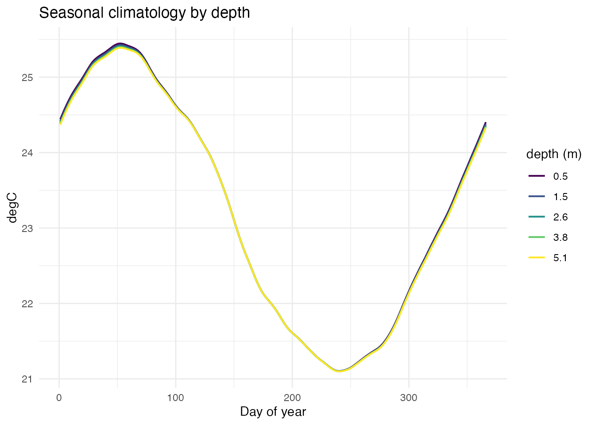
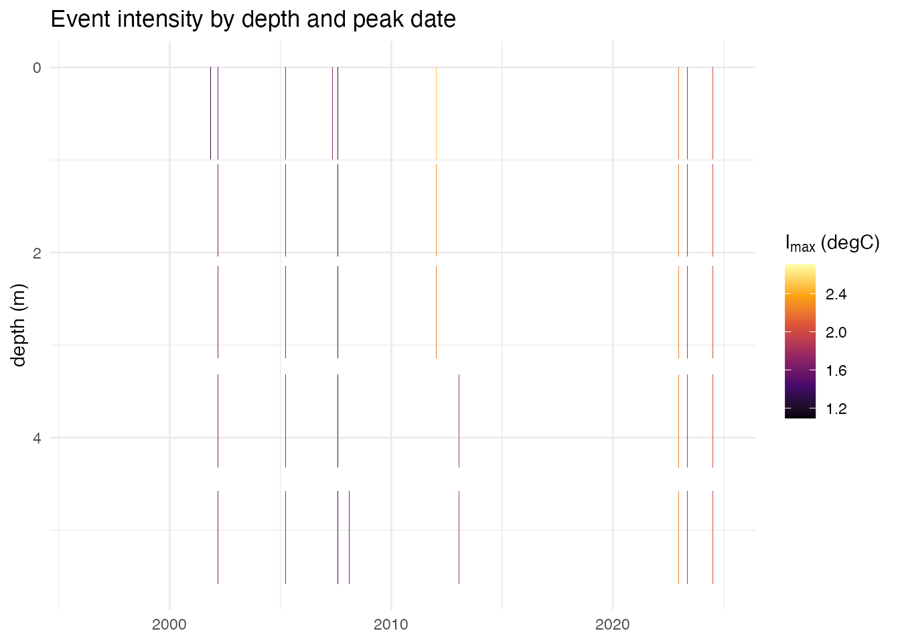
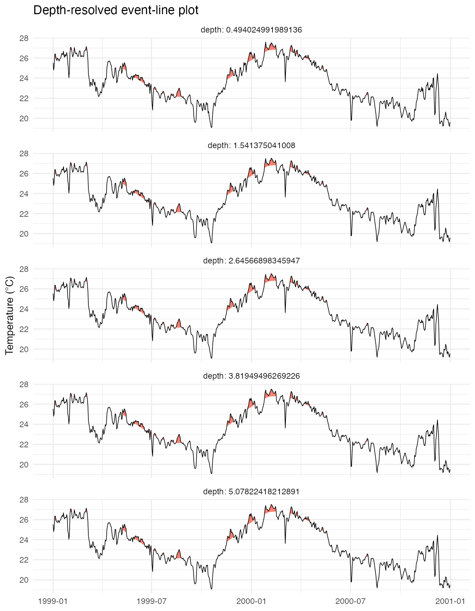
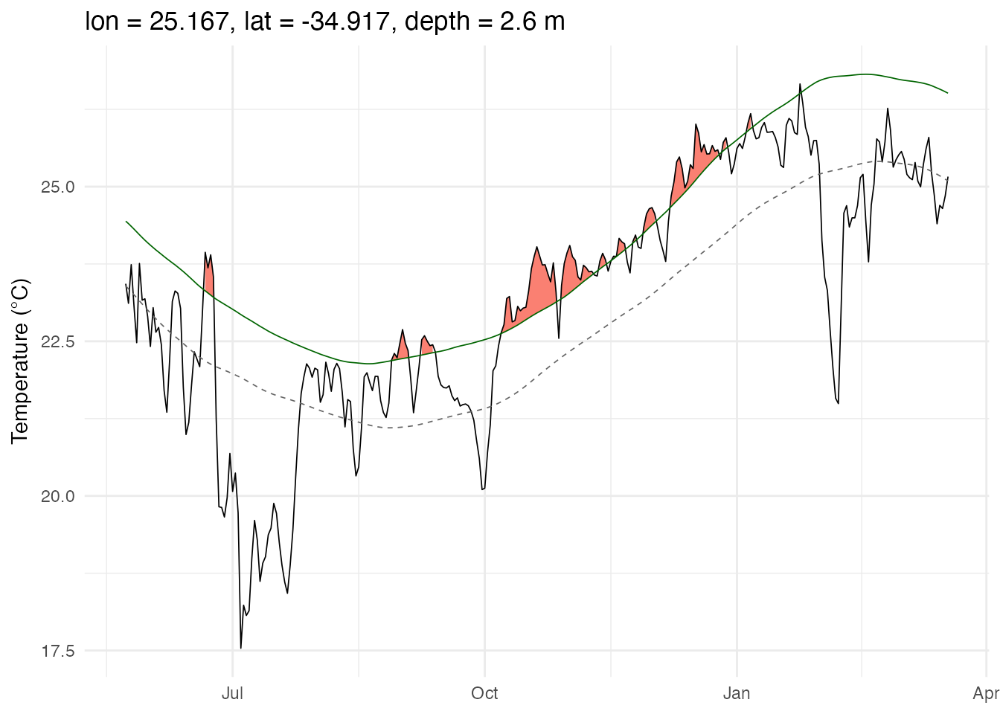
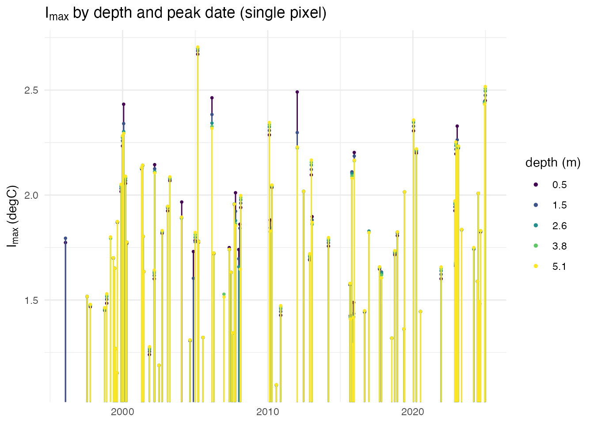

# Depth-resolved (4D) marine heatwave analysis

## Overview

Ocean reanalyses and models such as GLORYS12 provide temperature on a 4D
grid (`lon`, `lat`, `depth`, `time`), not just at the sea surface.
**heatwave3** can compute climatologies and detect events natively
across a **contiguous band of depth levels**, producing one 4D
climatology/event NetCDF instead of per-level 3D files.

Every chunk in this vignette runs against the tiny 2x2 pixel, 5
depth-level GLORYS12 fixture bundled with the package
(`system.file("extdata/glorys_depth_test.nc", package = "heatwave3")`) –
the same one used by the test suite – so that the vignette actually
compiles when the documentation is built, rather than describing code no
one has run. Everything shown works identically on a full-resolution
file with many more pixels and depth levels; just substitute your own
`sst_file`. The trade-off of the small fixture is scale, not behaviour:
with only 4 horizontal pixels and 5 depth levels (0.49-5.08 m, all
within the mixed layer), don’t expect dramatic spatial or vertical
structure in the figures below – for that, see
[`vignette("blob-depth-connectivity")`](https://robwschlegel.github.io/heatwave3/index.html/articles/blob-depth-connectivity.md),
which is built around exactly that kind of vertical structure using the
same fixture.

``` r

library(heatwave3)

sst_file <- system.file("extdata/glorys_depth_test.nc", package = "heatwave3")
clim_period <- c("1993-01-01", "2019-12-31")
```

## Two ways to work across depth

### Option A: per-level looping (works today, zero new code)

Before `depth_range` existed, the only way to get per-depth results was
to run the ordinary 3D pipeline once per level, squeezing to a single
depth index each time with the existing `depth` argument. This is still
a legitimate, simple approach: it can be run in parallel across depth
and reuses the same validated 3D code path as every other heatwave3
analysis.

``` r

n_depth <- 5L  # number of depth levels in this fixture

depth_indices <- seq_len(n_depth) - 1L  # depth= is a 0-based index: 0, 1, 2, 3, 4
purrr::walk(depth_indices, \(k) {
  detect3(sst_file, name = file.path(tempdir(), paste0("mhw_z", k)),
          climatologyPeriod = clim_period,
          depth = k, category = TRUE, quiet = TRUE)
})
#> Reading SST data from /private/var/folders/3w/nmplbnm109b9903rx8z9q0kc0000gn/T/RtmppsylXt/temp_libpathec9b232dd03/heatwave3/extdata/glorys_depth_test.nc...
#> Grid: 2 lon x 2 lat x 11688 time = 4 pixels
#> Computing climatology with 1 thread(s)...
#>   1/4 pixels (25%)  2/4 pixels (50%)  3/4 pixels (75%)  4/4 pixels (100%)
#> Writing climatology to /var/folders/3w/nmplbnm109b9903rx8z9q0kc0000gn/T//RtmpmEoTrR/mhw_z0_clim.nc...
#> Done.
#> Reading climatology from /var/folders/3w/nmplbnm109b9903rx8z9q0kc0000gn/T//RtmpmEoTrR/mhw_z0_clim.nc...
#> Reading SST data from /private/var/folders/3w/nmplbnm109b9903rx8z9q0kc0000gn/T/RtmppsylXt/temp_libpathec9b232dd03/heatwave3/extdata/glorys_depth_test.nc...
#> Grid: 2 lon x 2 lat x 11688 time = 4 pixels
#> Detecting events with 1 thread(s)...
#>   1/4 pixels (25%)  2/4 pixels (50%)  3/4 pixels (75%)  4/4 pixels (100%)
#> Found 316 events across 4 pixels
#> Writing events to /var/folders/3w/nmplbnm109b9903rx8z9q0kc0000gn/T//RtmpmEoTrR/mhw_z0_events.nc...
#> Done.
#> Reading SST data from /private/var/folders/3w/nmplbnm109b9903rx8z9q0kc0000gn/T/RtmppsylXt/temp_libpathec9b232dd03/heatwave3/extdata/glorys_depth_test.nc...
#> Grid: 2 lon x 2 lat x 11688 time = 4 pixels
#> Computing climatology with 1 thread(s)...
#>   1/4 pixels (25%)  2/4 pixels (50%)  3/4 pixels (75%)  4/4 pixels (100%)
#> Writing climatology to /var/folders/3w/nmplbnm109b9903rx8z9q0kc0000gn/T//RtmpmEoTrR/mhw_z1_clim.nc...
#> Done.
#> Reading climatology from /var/folders/3w/nmplbnm109b9903rx8z9q0kc0000gn/T//RtmpmEoTrR/mhw_z1_clim.nc...
#> Reading SST data from /private/var/folders/3w/nmplbnm109b9903rx8z9q0kc0000gn/T/RtmppsylXt/temp_libpathec9b232dd03/heatwave3/extdata/glorys_depth_test.nc...
#> Grid: 2 lon x 2 lat x 11688 time = 4 pixels
#> Detecting events with 1 thread(s)...
#>   1/4 pixels (25%)  2/4 pixels (50%)  3/4 pixels (75%)  4/4 pixels (100%)
#> Found 323 events across 4 pixels
#> Writing events to /var/folders/3w/nmplbnm109b9903rx8z9q0kc0000gn/T//RtmpmEoTrR/mhw_z1_events.nc...
#> Done.
#> Reading SST data from /private/var/folders/3w/nmplbnm109b9903rx8z9q0kc0000gn/T/RtmppsylXt/temp_libpathec9b232dd03/heatwave3/extdata/glorys_depth_test.nc...
#> Grid: 2 lon x 2 lat x 11688 time = 4 pixels
#> Computing climatology with 1 thread(s)...
#>   1/4 pixels (25%)  2/4 pixels (50%)  3/4 pixels (75%)  4/4 pixels (100%)
#> Writing climatology to /var/folders/3w/nmplbnm109b9903rx8z9q0kc0000gn/T//RtmpmEoTrR/mhw_z2_clim.nc...
#> Done.
#> Reading climatology from /var/folders/3w/nmplbnm109b9903rx8z9q0kc0000gn/T//RtmpmEoTrR/mhw_z2_clim.nc...
#> Reading SST data from /private/var/folders/3w/nmplbnm109b9903rx8z9q0kc0000gn/T/RtmppsylXt/temp_libpathec9b232dd03/heatwave3/extdata/glorys_depth_test.nc...
#> Grid: 2 lon x 2 lat x 11688 time = 4 pixels
#> Detecting events with 1 thread(s)...
#>   1/4 pixels (25%)  2/4 pixels (50%)  3/4 pixels (75%)  4/4 pixels (100%)
#> Found 323 events across 4 pixels
#> Writing events to /var/folders/3w/nmplbnm109b9903rx8z9q0kc0000gn/T//RtmpmEoTrR/mhw_z2_events.nc...
#> Done.
#> Reading SST data from /private/var/folders/3w/nmplbnm109b9903rx8z9q0kc0000gn/T/RtmppsylXt/temp_libpathec9b232dd03/heatwave3/extdata/glorys_depth_test.nc...
#> Grid: 2 lon x 2 lat x 11688 time = 4 pixels
#> Computing climatology with 1 thread(s)...
#>   1/4 pixels (25%)  2/4 pixels (50%)  3/4 pixels (75%)  4/4 pixels (100%)
#> Writing climatology to /var/folders/3w/nmplbnm109b9903rx8z9q0kc0000gn/T//RtmpmEoTrR/mhw_z3_clim.nc...
#> Done.
#> Reading climatology from /var/folders/3w/nmplbnm109b9903rx8z9q0kc0000gn/T//RtmpmEoTrR/mhw_z3_clim.nc...
#> Reading SST data from /private/var/folders/3w/nmplbnm109b9903rx8z9q0kc0000gn/T/RtmppsylXt/temp_libpathec9b232dd03/heatwave3/extdata/glorys_depth_test.nc...
#> Grid: 2 lon x 2 lat x 11688 time = 4 pixels
#> Detecting events with 1 thread(s)...
#>   1/4 pixels (25%)  2/4 pixels (50%)  3/4 pixels (75%)  4/4 pixels (100%)
#> Found 326 events across 4 pixels
#> Writing events to /var/folders/3w/nmplbnm109b9903rx8z9q0kc0000gn/T//RtmpmEoTrR/mhw_z3_events.nc...
#> Done.
#> Reading SST data from /private/var/folders/3w/nmplbnm109b9903rx8z9q0kc0000gn/T/RtmppsylXt/temp_libpathec9b232dd03/heatwave3/extdata/glorys_depth_test.nc...
#> Grid: 2 lon x 2 lat x 11688 time = 4 pixels
#> Computing climatology with 1 thread(s)...
#>   1/4 pixels (25%)  2/4 pixels (50%)  3/4 pixels (75%)  4/4 pixels (100%)
#> Writing climatology to /var/folders/3w/nmplbnm109b9903rx8z9q0kc0000gn/T//RtmpmEoTrR/mhw_z4_clim.nc...
#> Done.
#> Reading climatology from /var/folders/3w/nmplbnm109b9903rx8z9q0kc0000gn/T//RtmpmEoTrR/mhw_z4_clim.nc...
#> Reading SST data from /private/var/folders/3w/nmplbnm109b9903rx8z9q0kc0000gn/T/RtmppsylXt/temp_libpathec9b232dd03/heatwave3/extdata/glorys_depth_test.nc...
#> Grid: 2 lon x 2 lat x 11688 time = 4 pixels
#> Detecting events with 1 thread(s)...
#>   1/4 pixels (25%)  2/4 pixels (50%)  3/4 pixels (75%)  4/4 pixels (100%)
#> Found 326 events across 4 pixels
#> Writing events to /var/folders/3w/nmplbnm109b9903rx8z9q0kc0000gn/T//RtmpmEoTrR/mhw_z4_events.nc...
#> Done.
```

The trade-off: this produces `n_depth` separate pairs of `_clim.nc`/
`_events.nc` files, each with `n_depth`-fold repeated I/O over the same
lon/lat/time grid, and there is no vertical linkage between levels (each
is detected completely independently, as if it were its own 3D dataset).
For users who just want “climatology and events at 20 m, 50 m, 100 m…”
this may already be enough – stack the files yourself downstream with
`xarray` (python), `terra` (R), or CDO (bash).

### Option B: native `depth_range` (recommended)

`depth_range = c(min_depth, max_depth)` (metres, inclusive) tells
[`ts2clm3()`](https://robwschlegel.github.io/heatwave3/index.html/reference/ts2clm3.md)
and
[`detect3()`](https://robwschlegel.github.io/heatwave3/index.html/reference/detect3.md)
to read every depth level whose coordinate falls in that range and
compute an independent climatology/event table for every
`(lon, lat, depth)` triple, in **one** call producing **one** 4D file.
This avoids the repeated I/O and per-level file bookkeeping of Option A
above. The fixture’s 5 levels all fall within 0-10 m:

``` r

stem <- file.path(tempdir(), "mhw4d")
clim_file <- ts2clm3(file_in = sst_file,
                     name = stem,
                     climatologyPeriod = clim_period,
                     depth_range = c(0, 10),
                     n_threads = 2)
#> Reading SST data from /private/var/folders/3w/nmplbnm109b9903rx8z9q0kc0000gn/T/RtmppsylXt/temp_libpathec9b232dd03/heatwave3/extdata/glorys_depth_test.nc...
#> Grid: 2 lon x 2 lat x 5 depth x 11688 time = 20 pixels
#> Computing climatology with 2 thread(s)...
#>   20/20 pixels (100%)
#> Writing climatology to /var/folders/3w/nmplbnm109b9903rx8z9q0kc0000gn/T//RtmpmEoTrR/mhw4d_clim.nc...
#> Done.
#> 
#> ------------------------------------------------------------------
#> Climatology written to: /var/folders/3w/nmplbnm109b9903rx8z9q0kc0000gn/T//RtmpmEoTrR/mhw4d_clim.nc
#> Rows (long format): 7,320   grid: 2 lon x 2 lat
#> 
#> Head:
#>        lon       lat doy    seas  thresh    depth
#> 1 25.16667 -34.91667   1 24.4421 25.7957 0.494025
#> 2 25.16667 -34.91667   2 24.4798 25.8305 0.494025
#> 3 25.16667 -34.91667   3 24.5167 25.8673 0.494025
#> 4 25.16667 -34.91667   4 24.5528 25.9038 0.494025
#> 5 25.16667 -34.91667   5 24.5878 25.9396 0.494025
#> 
#> Tail:
#>        lon       lat doy    seas  thresh    depth
#> 7316 25.25 -34.83333 362 24.0087 25.4949 5.078224
#> 7317 25.25 -34.83333 363 24.0447 25.5349 5.078224
#> 7318 25.25 -34.83333 364 24.0814 25.5727 5.078224
#> 7319 25.25 -34.83333 365 24.1189 25.6097 5.078224
#> 7320 25.25 -34.83333 366 24.1567 25.6499 5.078224
#> 
#> Summary:
#>   ocean pixels (valid climatology): 4
#>   seas:   20.98 to 25.55
#>   thresh:    22 to 26.92
#> 
#> Examine with  hw3_export("/var/folders/3w/nmplbnm109b9903rx8z9q0kc0000gn/T//RtmpmEoTrR/mhw4d_clim.nc", n = 20)
#> or export with hw3_export("/var/folders/3w/nmplbnm109b9903rx8z9q0kc0000gn/T//RtmpmEoTrR/mhw4d_clim.nc", file_out = "out.csv")  (.csv/.rds/.parquet)
#> ------------------------------------------------------------------
```

[`detect_event3()`](https://robwschlegel.github.io/heatwave3/index.html/reference/detect_event3.md)
needs no separate depth argument at all: it reads the depth range
straight back out of the climatology file it is already loading, so
climatology and event detection can never end up out of sync about which
levels they are comparing.

``` r

event_file <- detect_event3(file_in = sst_file,
                            name = stem,
                            category = TRUE,
                            n_threads = 2)
#> Reading climatology from /var/folders/3w/nmplbnm109b9903rx8z9q0kc0000gn/T//RtmpmEoTrR/mhw4d_clim.nc...
#> Reading SST data from /private/var/folders/3w/nmplbnm109b9903rx8z9q0kc0000gn/T/RtmppsylXt/temp_libpathec9b232dd03/heatwave3/extdata/glorys_depth_test.nc...
#> Grid: 2 lon x 2 lat x 5 depth x 11688 time = 20 pixels
#> Detecting events with 2 thread(s)...
#>   20/20 pixels (100%)
#> Found 1614 events across 20 pixels
#> Writing events to /var/folders/3w/nmplbnm109b9903rx8z9q0kc0000gn/T//RtmpmEoTrR/mhw4d_events.nc...
#> Done.
#> 
#> ------------------------------------------------------------------
#> Events written to: /var/folders/3w/nmplbnm109b9903rx8z9q0kc0000gn/T//RtmpmEoTrR/mhw4d_events.nc
#> Rows (long format): 1,614
#> 
#> Head:
#>        lon       lat pixel_index event_no date_start  date_peak   date_end
#> 1 25.16667 -34.91667           0        1 1996-01-21 1996-01-24 1996-01-26
#> 2 25.16667 -34.91667           0        2 1997-07-18 1997-07-21 1997-07-22
#> 3 25.16667 -34.91667           0        3 1997-10-03 1997-10-10 1997-10-12
#> 4 25.16667 -34.91667           0        4 1998-11-23 1998-11-27 1998-11-27
#> 5 25.16667 -34.91667           0        5 1999-05-09 1999-05-12 1999-05-15
#>   duration intensity_mean intensity_max intensity_var intensity_cumulative
#> 1        6         1.5865        1.7736        0.1317               9.5189
#> 2        5         1.2510        1.5161        0.2516               6.2549
#> 3       10         1.2946        1.4676        0.1200              12.9463
#> 4        5         1.2410        1.4843        0.1530               6.2048
#> 5        7         1.4740        1.6994        0.1584              10.3179
#>   intensity_mean_relThresh intensity_max_relThresh intensity_var_relThresh
#> 1                   0.1453                  0.3288                  0.1244
#> 2                   0.2992                  0.5704                  0.2586
#> 3                   0.2006                  0.3803                  0.1188
#> 4                   0.1795                  0.4009                  0.1383
#> 5                   0.4610                  0.6895                  0.1601
#>   intensity_cumulative_relThresh intensity_mean_abs intensity_max_abs
#> 1                         0.8717            26.6664           26.8669
#> 2                         1.4958            22.8343           23.0860
#> 3                         2.0058            22.8490           23.0794
#> 4                         0.8976            24.3392           24.6432
#> 5                         3.2267            25.3127           25.5404
#>   intensity_var_abs intensity_cumulative_abs rate_onset rate_decline    depth
#> 1            0.1634                 159.9986     0.0985       0.0729 0.494025
#> 2            0.2383                 114.1717     0.1560       0.1805 0.494025
#> 3            0.1284                 228.4898     0.0133       0.1407 0.494025
#> 4            0.1960                 121.6961     0.0799       0.0000 0.494025
#> 5            0.1680                 177.1892     0.0494       0.0851 0.494025
#>     category p_moderate p_strong p_severe p_extreme season
#> 1 I Moderate          1   0.2276        0         0 Summer
#> 2 I Moderate          1   0.6032        0         0 Winter
#> 3 I Moderate          1   0.3498        0         0 Spring
#> 4 I Moderate          1   0.3700        0         0 Spring
#> 5 I Moderate          1   0.6828        0         0   Fall
#> 
#> Tail:
#>        lon       lat pixel_index event_no date_start  date_peak   date_end
#> 1610 25.25 -34.83333          18       79 2024-06-23 2024-06-25 2024-07-01
#> 1611 25.25 -34.83333          18       80 2024-07-15 2024-07-19 2024-07-28
#> 1612 25.25 -34.83333          18       81 2024-08-07 2024-08-20 2024-09-03
#> 1613 25.25 -34.83333          18       82 2024-12-08 2024-12-08 2024-12-14
#> 1614 25.25 -34.83333          18       83 2024-12-18 2024-12-23 2024-12-29
#>      duration intensity_mean intensity_max intensity_var intensity_cumulative
#> 1610        9         1.5017        1.6836        0.1564              13.5150
#> 1611       14         1.1987        1.6393        0.1932              16.7822
#> 1612       28         1.4298        2.3913        0.3482              40.0337
#> 1613        7         2.0255        2.4800        0.4034              14.1785
#> 1614       12         2.0775        2.3796        0.2661              24.9299
#>      intensity_mean_relThresh intensity_max_relThresh intensity_var_relThresh
#> 1610                   0.3836                  0.5506                  0.1543
#> 1611                   0.2597                  0.6807                  0.1793
#> 1612                   0.4674                  1.4444                  0.3469
#> 1613                   0.7981                  1.2835                  0.4274
#> 1614                   0.6444                  0.9559                  0.2627
#>      intensity_cumulative_relThresh intensity_mean_abs intensity_max_abs
#> 1610                         3.4525            23.4180           23.6375
#> 1611                         3.6362            22.7199           23.1878
#> 1612                        13.0874            22.5690           23.5094
#> 1613                         5.5866            25.5139           25.8759
#> 1614                         7.7328            25.9767           26.2589
#>      intensity_var_abs intensity_cumulative_abs rate_onset rate_decline
#> 1610            0.1754                 210.7624     0.1591       0.0695
#> 1611            0.2205                 318.0784     0.1170       0.0720
#> 1612            0.3456                 631.9313     0.0781       0.0735
#> 1613            0.3446                 178.5976     0.0000       0.1807
#> 1614            0.2882                 311.7206     0.1368       0.1079
#>         depth   category p_moderate p_strong p_severe p_extreme season
#> 1610 3.819495 I Moderate          1   0.4860   0.0000         0 Winter
#> 1611 3.819495 I Moderate          1   0.7101   0.0000         0 Winter
#> 1612 3.819495  II Strong          1   1.0000   0.5254         0 Winter
#> 1613 3.819495  II Strong          1   1.0000   0.0727         0 Summer
#> 1614 3.819495 I Moderate          1   0.6553   0.0000         0 Summer
#> 
#> Summary:
#>   events: 1614   pixels with events: 4
#>   dates:  1996-01-21 to 2024-12-29
#>   duration (days):     5 to    34
#>   intensity_max:   0.9695 to 3.165
#>   category: I Moderate=1531  II Strong=83
#> 
#> Examine with  hw3_export("/var/folders/3w/nmplbnm109b9903rx8z9q0kc0000gn/T//RtmpmEoTrR/mhw4d_events.nc", n = 20)
#> or export with hw3_export("/var/folders/3w/nmplbnm109b9903rx8z9q0kc0000gn/T//RtmpmEoTrR/mhw4d_events.nc", file_out = "out.csv")  (.csv/.rds/.parquet)
#> ------------------------------------------------------------------
```

Or as a single call via
[`detect3()`](https://robwschlegel.github.io/heatwave3/index.html/reference/detect3.md):

``` r

detect3(file_in = sst_file,
        name = stem,
        climatologyPeriod = clim_period,
        depth_range = c(0, 10),
        category = TRUE,
        n_threads = 2)
#> Reading SST data from /private/var/folders/3w/nmplbnm109b9903rx8z9q0kc0000gn/T/RtmppsylXt/temp_libpathec9b232dd03/heatwave3/extdata/glorys_depth_test.nc...
#> Grid: 2 lon x 2 lat x 5 depth x 11688 time = 20 pixels
#> Computing climatology with 2 thread(s)...
#>   20/20 pixels (100%)
#> Writing climatology to /var/folders/3w/nmplbnm109b9903rx8z9q0kc0000gn/T//RtmpmEoTrR/mhw4d_clim.nc...
#> Done.
#> 
#> ------------------------------------------------------------------
#> Climatology written to: /var/folders/3w/nmplbnm109b9903rx8z9q0kc0000gn/T//RtmpmEoTrR/mhw4d_clim.nc
#> Rows (long format): 7,320   grid: 2 lon x 2 lat
#> 
#> Head:
#>        lon       lat doy    seas  thresh    depth
#> 1 25.16667 -34.91667   1 24.4421 25.7957 0.494025
#> 2 25.16667 -34.91667   2 24.4798 25.8305 0.494025
#> 3 25.16667 -34.91667   3 24.5167 25.8673 0.494025
#> 4 25.16667 -34.91667   4 24.5528 25.9038 0.494025
#> 5 25.16667 -34.91667   5 24.5878 25.9396 0.494025
#> 
#> Tail:
#>        lon       lat doy    seas  thresh    depth
#> 7316 25.25 -34.83333 362 24.0087 25.4949 5.078224
#> 7317 25.25 -34.83333 363 24.0447 25.5349 5.078224
#> 7318 25.25 -34.83333 364 24.0814 25.5727 5.078224
#> 7319 25.25 -34.83333 365 24.1189 25.6097 5.078224
#> 7320 25.25 -34.83333 366 24.1567 25.6499 5.078224
#> 
#> Summary:
#>   ocean pixels (valid climatology): 4
#>   seas:   20.98 to 25.55
#>   thresh:    22 to 26.92
#> 
#> Examine with  hw3_export("/var/folders/3w/nmplbnm109b9903rx8z9q0kc0000gn/T//RtmpmEoTrR/mhw4d_clim.nc", n = 20)
#> or export with hw3_export("/var/folders/3w/nmplbnm109b9903rx8z9q0kc0000gn/T//RtmpmEoTrR/mhw4d_clim.nc", file_out = "out.csv")  (.csv/.rds/.parquet)
#> ------------------------------------------------------------------
#> Reading climatology from /var/folders/3w/nmplbnm109b9903rx8z9q0kc0000gn/T//RtmpmEoTrR/mhw4d_clim.nc...
#> Reading SST data from /private/var/folders/3w/nmplbnm109b9903rx8z9q0kc0000gn/T/RtmppsylXt/temp_libpathec9b232dd03/heatwave3/extdata/glorys_depth_test.nc...
#> Grid: 2 lon x 2 lat x 5 depth x 11688 time = 20 pixels
#> Detecting events with 2 thread(s)...
#>   20/20 pixels (100%)
#> Found 1614 events across 20 pixels
#> Writing events to /var/folders/3w/nmplbnm109b9903rx8z9q0kc0000gn/T//RtmpmEoTrR/mhw4d_events.nc...
#> Done.
#> 
#> ------------------------------------------------------------------
#> Events written to: /var/folders/3w/nmplbnm109b9903rx8z9q0kc0000gn/T//RtmpmEoTrR/mhw4d_events.nc
#> Rows (long format): 1,614
#> 
#> Head:
#>        lon       lat pixel_index event_no date_start  date_peak   date_end
#> 1 25.16667 -34.91667           0        1 1996-01-21 1996-01-24 1996-01-26
#> 2 25.16667 -34.91667           0        2 1997-07-18 1997-07-21 1997-07-22
#> 3 25.16667 -34.91667           0        3 1997-10-03 1997-10-10 1997-10-12
#> 4 25.16667 -34.91667           0        4 1998-11-23 1998-11-27 1998-11-27
#> 5 25.16667 -34.91667           0        5 1999-05-09 1999-05-12 1999-05-15
#>   duration intensity_mean intensity_max intensity_var intensity_cumulative
#> 1        6         1.5865        1.7736        0.1317               9.5189
#> 2        5         1.2510        1.5161        0.2516               6.2549
#> 3       10         1.2946        1.4676        0.1200              12.9463
#> 4        5         1.2410        1.4843        0.1530               6.2048
#> 5        7         1.4740        1.6994        0.1584              10.3179
#>   intensity_mean_relThresh intensity_max_relThresh intensity_var_relThresh
#> 1                   0.1453                  0.3288                  0.1244
#> 2                   0.2992                  0.5704                  0.2586
#> 3                   0.2006                  0.3803                  0.1188
#> 4                   0.1795                  0.4009                  0.1383
#> 5                   0.4610                  0.6895                  0.1601
#>   intensity_cumulative_relThresh intensity_mean_abs intensity_max_abs
#> 1                         0.8717            26.6664           26.8669
#> 2                         1.4958            22.8343           23.0860
#> 3                         2.0058            22.8490           23.0794
#> 4                         0.8976            24.3392           24.6432
#> 5                         3.2267            25.3127           25.5404
#>   intensity_var_abs intensity_cumulative_abs rate_onset rate_decline    depth
#> 1            0.1634                 159.9986     0.0985       0.0729 0.494025
#> 2            0.2383                 114.1717     0.1560       0.1805 0.494025
#> 3            0.1284                 228.4898     0.0133       0.1407 0.494025
#> 4            0.1960                 121.6961     0.0799       0.0000 0.494025
#> 5            0.1680                 177.1892     0.0494       0.0851 0.494025
#>     category p_moderate p_strong p_severe p_extreme season
#> 1 I Moderate          1   0.2276        0         0 Summer
#> 2 I Moderate          1   0.6032        0         0 Winter
#> 3 I Moderate          1   0.3498        0         0 Spring
#> 4 I Moderate          1   0.3700        0         0 Spring
#> 5 I Moderate          1   0.6828        0         0   Fall
#> 
#> Tail:
#>        lon       lat pixel_index event_no date_start  date_peak   date_end
#> 1610 25.25 -34.83333          19       77 2024-06-23 2024-06-25 2024-07-01
#> 1611 25.25 -34.83333          19       78 2024-07-15 2024-07-19 2024-07-28
#> 1612 25.25 -34.83333          19       79 2024-08-07 2024-08-20 2024-09-03
#> 1613 25.25 -34.83333          19       80 2024-12-08 2024-12-08 2024-12-14
#> 1614 25.25 -34.83333          19       81 2024-12-18 2024-12-23 2024-12-29
#>      duration intensity_mean intensity_max intensity_var intensity_cumulative
#> 1610        9         1.5018        1.6837        0.1564              13.5160
#> 1611       14         1.1989        1.6394        0.1932              16.7848
#> 1612       28         1.4304        2.3920        0.3483              40.0519
#> 1613        7         2.0314        2.4793        0.3988              14.2196
#> 1614       12         2.0886        2.3930        0.2649              25.0638
#>      intensity_mean_relThresh intensity_max_relThresh intensity_var_relThresh
#> 1610                   0.3836                  0.5506                  0.1543
#> 1611                   0.2598                  0.6808                  0.1793
#> 1612                   0.4680                  1.4450                  0.3469
#> 1613                   0.8006                  1.2799                  0.4230
#> 1614                   0.6494                  0.9636                  0.2617
#>      intensity_cumulative_relThresh intensity_mean_abs intensity_max_abs
#> 1610                         3.4525            23.4180           23.6375
#> 1611                         3.6376            22.7199           23.1878
#> 1612                        13.1050            22.5689           23.5094
#> 1613                         5.6043            25.5093           25.8656
#> 1614                         7.7930            25.9745           26.2589
#>      intensity_var_abs intensity_cumulative_abs rate_onset rate_decline
#> 1610            0.1754                 210.7624     0.1591       0.0695
#> 1611            0.2205                 318.0784     0.1170       0.0720
#> 1612            0.3456                 631.9298     0.0782       0.0736
#> 1613            0.3408                 178.5654     0.0000       0.1790
#> 1614            0.2870                 311.6935     0.1370       0.1078
#>         depth   category p_moderate p_strong p_severe p_extreme season
#> 1610 5.078224 I Moderate          1   0.4860   0.0000         0 Winter
#> 1611 5.078224 I Moderate          1   0.7102   0.0000         0 Winter
#> 1612 5.078224  II Strong          1   1.0000   0.5258         0 Winter
#> 1613 5.078224  II Strong          1   1.0000   0.0671         0 Summer
#> 1614 5.078224 I Moderate          1   0.6577   0.0000         0 Summer
#> 
#> Summary:
#>   events: 1614   pixels with events: 4
#>   dates:  1996-01-21 to 2024-12-29
#>   duration (days):     5 to    34
#>   intensity_max:   0.9695 to 3.165
#>   category: I Moderate=1531  II Strong=83
#> 
#> Examine with  hw3_export("/var/folders/3w/nmplbnm109b9903rx8z9q0kc0000gn/T//RtmpmEoTrR/mhw4d_events.nc", n = 20)
#> or export with hw3_export("/var/folders/3w/nmplbnm109b9903rx8z9q0kc0000gn/T//RtmpmEoTrR/mhw4d_events.nc", file_out = "out.csv")  (.csv/.rds/.parquet)
#> ------------------------------------------------------------------
```

## Reading the depth-resolved output

[`hw3_export()`](https://robwschlegel.github.io/heatwave3/index.html/reference/hw3_export.md)
surfaces a `depth` column automatically whenever the source file is
depth-resolved:

``` r

clim_df  <- hw3_export(paste0(stem, "_clim.nc"))
event_df <- hw3_export(paste0(stem, "_events.nc"))

head(clim_df)
#>        lon       lat doy    seas  thresh    depth
#> 1 25.16667 -34.91667   1 24.4421 25.7957 0.494025
#> 2 25.16667 -34.91667   2 24.4798 25.8305 0.494025
#> 3 25.16667 -34.91667   3 24.5167 25.8673 0.494025
#> 4 25.16667 -34.91667   4 24.5528 25.9038 0.494025
#> 5 25.16667 -34.91667   5 24.5878 25.9396 0.494025
#> 6 25.16667 -34.91667   6 24.6215 25.9754 0.494025
table(round(event_df$depth, 2))
#> 
#> 0.49 1.54 2.65 3.82 5.08 
#>  316  323  323  326  326
```

Because every `(lon, lat, depth)` triple gets its own climatology, the
seasonal cycle and threshold both flatten out with depth – the surface
has the largest seasonal amplitude and the highest threshold, decaying
as you move down through the mixed layer. This is already visible
directly from the exported climatology data frame, with no new plotting
functions required (the effect is subtle here since all 5 levels sit
within the top 5 m; it’s more pronounced across a deeper range on a real
file):

``` r

library(ggplot2)

one_pixel <- subset(clim_df, lon == clim_df$lon[1] & lat == clim_df$lat[1])

ggplot(one_pixel, aes(doy, seas, colour = factor(round(depth, 1)))) +
  geom_line(linewidth = 0.7) +
  scale_colour_viridis_d(name = "depth (m)") +
  labs(title = "Seasonal climatology by depth", x = "Day of year", y = "degC") +
  theme_minimal(base_size = 11)
```



A depth-time Hovmoeller-style view of event intensity is also already
possible by building the plot directly from `event_df`, without any new
graphics functions:

``` r

one_pixel_events <- subset(event_df, lon == event_df$lon[1] & lat == event_df$lat[1])

ggplot(one_pixel_events, aes(x = date_peak, y = depth, fill = intensity_max)) +
  geom_tile(height = 1) +
  scale_fill_viridis_c(name = expression(I[max] ~ "(degC)"), option = "inferno") +
  scale_y_reverse(name = "depth (m)") +
  labs(title = "Event intensity by depth and peak date", x = NULL) +
  theme_minimal(base_size = 11)
```



## Depth-resolved event-line plots with `geom_flame3()` / `geom_lolli3()`

The per-day product also carries a depth dimension now, so
`daily = "also"` works together with `depth_range` – no separate depth
argument needed here either, for the same reason
[`detect_event3()`](https://robwschlegel.github.io/heatwave3/index.html/reference/detect_event3.md)
doesn’t need one:

``` r

detect3(file_in = sst_file,
        name = stem,
        climatologyPeriod = clim_period,
        depth_range = c(0, 10),
        category = TRUE,
        daily = "also",
        n_threads = 2)
#> Reading SST data from /private/var/folders/3w/nmplbnm109b9903rx8z9q0kc0000gn/T/RtmppsylXt/temp_libpathec9b232dd03/heatwave3/extdata/glorys_depth_test.nc...
#> Grid: 2 lon x 2 lat x 5 depth x 11688 time = 20 pixels
#> Computing climatology with 2 thread(s)...
#>   20/20 pixels (100%)
#> Writing climatology to /var/folders/3w/nmplbnm109b9903rx8z9q0kc0000gn/T//RtmpmEoTrR/mhw4d_clim.nc...
#> Done.
#> 
#> ------------------------------------------------------------------
#> Climatology written to: /var/folders/3w/nmplbnm109b9903rx8z9q0kc0000gn/T//RtmpmEoTrR/mhw4d_clim.nc
#> Rows (long format): 7,320   grid: 2 lon x 2 lat
#> 
#> Head:
#>        lon       lat doy    seas  thresh    depth
#> 1 25.16667 -34.91667   1 24.4421 25.7957 0.494025
#> 2 25.16667 -34.91667   2 24.4798 25.8305 0.494025
#> 3 25.16667 -34.91667   3 24.5167 25.8673 0.494025
#> 4 25.16667 -34.91667   4 24.5528 25.9038 0.494025
#> 5 25.16667 -34.91667   5 24.5878 25.9396 0.494025
#> 
#> Tail:
#>        lon       lat doy    seas  thresh    depth
#> 7316 25.25 -34.83333 362 24.0087 25.4949 5.078224
#> 7317 25.25 -34.83333 363 24.0447 25.5349 5.078224
#> 7318 25.25 -34.83333 364 24.0814 25.5727 5.078224
#> 7319 25.25 -34.83333 365 24.1189 25.6097 5.078224
#> 7320 25.25 -34.83333 366 24.1567 25.6499 5.078224
#> 
#> Summary:
#>   ocean pixels (valid climatology): 4
#>   seas:   20.98 to 25.55
#>   thresh:    22 to 26.92
#> 
#> Examine with  hw3_export("/var/folders/3w/nmplbnm109b9903rx8z9q0kc0000gn/T//RtmpmEoTrR/mhw4d_clim.nc", n = 20)
#> or export with hw3_export("/var/folders/3w/nmplbnm109b9903rx8z9q0kc0000gn/T//RtmpmEoTrR/mhw4d_clim.nc", file_out = "out.csv")  (.csv/.rds/.parquet)
#> ------------------------------------------------------------------
#> Reading climatology from /var/folders/3w/nmplbnm109b9903rx8z9q0kc0000gn/T//RtmpmEoTrR/mhw4d_clim.nc...
#> Reading SST data from /private/var/folders/3w/nmplbnm109b9903rx8z9q0kc0000gn/T/RtmppsylXt/temp_libpathec9b232dd03/heatwave3/extdata/glorys_depth_test.nc...
#> Grid: 2 lon x 2 lat x 5 depth x 11688 time = 20 pixels
#> Detecting events with 2 thread(s)...
#>   20/20 pixels (100%)
#> Found 1614 events across 20 pixels
#> Writing per-day series to /var/folders/3w/nmplbnm109b9903rx8z9q0kc0000gn/T//RtmpmEoTrR/mhw4d_events_daily.nc...
#> Done.
#> Writing events to /var/folders/3w/nmplbnm109b9903rx8z9q0kc0000gn/T//RtmpmEoTrR/mhw4d_events.nc...
#> Done.
#> 
#> ------------------------------------------------------------------
#> Events written to: /var/folders/3w/nmplbnm109b9903rx8z9q0kc0000gn/T//RtmpmEoTrR/mhw4d_events.nc
#> Rows (long format): 1,614
#> 
#> Head:
#>        lon       lat pixel_index event_no date_start  date_peak   date_end
#> 1 25.16667 -34.91667           0        1 1996-01-21 1996-01-24 1996-01-26
#> 2 25.16667 -34.91667           0        2 1997-07-18 1997-07-21 1997-07-22
#> 3 25.16667 -34.91667           0        3 1997-10-03 1997-10-10 1997-10-12
#> 4 25.16667 -34.91667           0        4 1998-11-23 1998-11-27 1998-11-27
#> 5 25.16667 -34.91667           0        5 1999-05-09 1999-05-12 1999-05-15
#>   duration intensity_mean intensity_max intensity_var intensity_cumulative
#> 1        6         1.5865        1.7736        0.1317               9.5189
#> 2        5         1.2510        1.5161        0.2516               6.2549
#> 3       10         1.2946        1.4676        0.1200              12.9463
#> 4        5         1.2410        1.4843        0.1530               6.2048
#> 5        7         1.4740        1.6994        0.1584              10.3179
#>   intensity_mean_relThresh intensity_max_relThresh intensity_var_relThresh
#> 1                   0.1453                  0.3288                  0.1244
#> 2                   0.2992                  0.5704                  0.2586
#> 3                   0.2006                  0.3803                  0.1188
#> 4                   0.1795                  0.4009                  0.1383
#> 5                   0.4610                  0.6895                  0.1601
#>   intensity_cumulative_relThresh intensity_mean_abs intensity_max_abs
#> 1                         0.8717            26.6664           26.8669
#> 2                         1.4958            22.8343           23.0860
#> 3                         2.0058            22.8490           23.0794
#> 4                         0.8976            24.3392           24.6432
#> 5                         3.2267            25.3127           25.5404
#>   intensity_var_abs intensity_cumulative_abs rate_onset rate_decline    depth
#> 1            0.1634                 159.9986     0.0985       0.0729 0.494025
#> 2            0.2383                 114.1717     0.1560       0.1805 0.494025
#> 3            0.1284                 228.4898     0.0133       0.1407 0.494025
#> 4            0.1960                 121.6961     0.0799       0.0000 0.494025
#> 5            0.1680                 177.1892     0.0494       0.0851 0.494025
#>     category p_moderate p_strong p_severe p_extreme season
#> 1 I Moderate          1   0.2276        0         0 Summer
#> 2 I Moderate          1   0.6032        0         0 Winter
#> 3 I Moderate          1   0.3498        0         0 Spring
#> 4 I Moderate          1   0.3700        0         0 Spring
#> 5 I Moderate          1   0.6828        0         0   Fall
#> 
#> Tail:
#>        lon       lat pixel_index event_no date_start  date_peak   date_end
#> 1610 25.25 -34.83333          18       79 2024-06-23 2024-06-25 2024-07-01
#> 1611 25.25 -34.83333          18       80 2024-07-15 2024-07-19 2024-07-28
#> 1612 25.25 -34.83333          18       81 2024-08-07 2024-08-20 2024-09-03
#> 1613 25.25 -34.83333          18       82 2024-12-08 2024-12-08 2024-12-14
#> 1614 25.25 -34.83333          18       83 2024-12-18 2024-12-23 2024-12-29
#>      duration intensity_mean intensity_max intensity_var intensity_cumulative
#> 1610        9         1.5017        1.6836        0.1564              13.5150
#> 1611       14         1.1987        1.6393        0.1932              16.7822
#> 1612       28         1.4298        2.3913        0.3482              40.0337
#> 1613        7         2.0255        2.4800        0.4034              14.1785
#> 1614       12         2.0775        2.3796        0.2661              24.9299
#>      intensity_mean_relThresh intensity_max_relThresh intensity_var_relThresh
#> 1610                   0.3836                  0.5506                  0.1543
#> 1611                   0.2597                  0.6807                  0.1793
#> 1612                   0.4674                  1.4444                  0.3469
#> 1613                   0.7981                  1.2835                  0.4274
#> 1614                   0.6444                  0.9559                  0.2627
#>      intensity_cumulative_relThresh intensity_mean_abs intensity_max_abs
#> 1610                         3.4525            23.4180           23.6375
#> 1611                         3.6362            22.7199           23.1878
#> 1612                        13.0874            22.5690           23.5094
#> 1613                         5.5866            25.5139           25.8759
#> 1614                         7.7328            25.9767           26.2589
#>      intensity_var_abs intensity_cumulative_abs rate_onset rate_decline
#> 1610            0.1754                 210.7624     0.1591       0.0695
#> 1611            0.2205                 318.0784     0.1170       0.0720
#> 1612            0.3456                 631.9313     0.0781       0.0735
#> 1613            0.3446                 178.5976     0.0000       0.1807
#> 1614            0.2882                 311.7206     0.1368       0.1079
#>         depth   category p_moderate p_strong p_severe p_extreme season
#> 1610 3.819495 I Moderate          1   0.4860   0.0000         0 Winter
#> 1611 3.819495 I Moderate          1   0.7101   0.0000         0 Winter
#> 1612 3.819495  II Strong          1   1.0000   0.5254         0 Winter
#> 1613 3.819495  II Strong          1   1.0000   0.0727         0 Summer
#> 1614 3.819495 I Moderate          1   0.6553   0.0000         0 Summer
#> 
#> Summary:
#>   events: 1614   pixels with events: 4
#>   dates:  1996-01-21 to 2024-12-29
#>   duration (days):     5 to    34
#>   intensity_max:   0.9695 to 3.165
#>   category: I Moderate=1531  II Strong=83
#> 
#> Examine with  hw3_export("/var/folders/3w/nmplbnm109b9903rx8z9q0kc0000gn/T//RtmpmEoTrR/mhw4d_events.nc", n = 20)
#> or export with hw3_export("/var/folders/3w/nmplbnm109b9903rx8z9q0kc0000gn/T//RtmpmEoTrR/mhw4d_events.nc", file_out = "out.csv")  (.csv/.rds/.parquet)
#> ------------------------------------------------------------------
#> 
#> ------------------------------------------------------------------
#> Daily series written to: /var/folders/3w/nmplbnm109b9903rx8z9q0kc0000gn/T//RtmpmEoTrR/mhw4d_events_daily.nc
#> Rows (long format): 233,760   grid: 2 lon x 2 lat
#> 
#> Head:
#>        lon       lat          t     temp    seas  thresh intensity event
#> 1 25.16667 -34.91667 1993-01-01 25.30824 24.4421 25.7957    0.8661 FALSE
#> 2 25.16667 -34.91667 1993-01-02 25.82022 24.4798 25.8305    1.3404 FALSE
#> 3 25.16667 -34.91667 1993-01-03 25.55507 24.5167 25.8673    1.0384 FALSE
#> 4 25.16667 -34.91667 1993-01-04 25.36024 24.5528 25.9038    0.8074 FALSE
#> 5 25.16667 -34.91667 1993-01-05 25.50600 24.5878 25.9396    0.9182 FALSE
#>   event_no category    depth
#> 1       NA       NA 0.494025
#> 2       NA       NA 0.494025
#> 3       NA       NA 0.494025
#> 4       NA       NA 0.494025
#> 5       NA       NA 0.494025
#> 
#> Tail:
#>          lon       lat          t     temp    seas  thresh intensity event
#> 233756 25.25 -34.83333 2024-12-27 26.10294 24.0087 25.4949    2.0942  TRUE
#> 233757 25.25 -34.83333 2024-12-28 25.92349 24.0447 25.5349    1.8788  TRUE
#> 233758 25.25 -34.83333 2024-12-29 25.77407 24.0814 25.5727    1.6927  TRUE
#> 233759 25.25 -34.83333 2024-12-30 25.18079 24.1189 25.6097    1.0619 FALSE
#> 233760 25.25 -34.83333 2024-12-31 25.10389 24.1567 25.6499    0.9472 FALSE
#>        event_no category    depth
#> 233756       81        1 5.078224
#> 233757       81        1 5.078224
#> 233758       81        1 5.078224
#> 233759       NA       NA 5.078224
#> 233760       NA       NA 5.078224
#> 
#> Summary:
#>   dates: 1993-01-01 to 2024-12-31
#>   event-days: 14739
#>   category: 1=24861  2=148
#> 
#> Examine with  hw3_export("/var/folders/3w/nmplbnm109b9903rx8z9q0kc0000gn/T//RtmpmEoTrR/mhw4d_events_daily.nc", n = 20)
#> or export with hw3_export("/var/folders/3w/nmplbnm109b9903rx8z9q0kc0000gn/T//RtmpmEoTrR/mhw4d_events_daily.nc", file_out = "out.csv")  (.csv/.rds/.parquet)
#> ------------------------------------------------------------------
```

[`hw3_export()`](https://robwschlegel.github.io/heatwave3/index.html/reference/hw3_export.md)
surfaces the same `depth` column on this per-day product, and its
streaming subset
(`lon_range`/`lat_range`/`time_range`/`depth_range`/`n`) is depth-aware
too, so a single pixel’s full depth profile over a short date window
reads cheaply without loading the whole file:

``` r

daily_df <- hw3_export(paste0(stem, "_events_daily.nc"),
                       lon_range = c(25.16, 25.17), lat_range = c(-34.92, -34.91),
                       time_range = c("1999-01-01", "2000-12-31"))
head(daily_df)
#>        lon       lat          t     temp    seas  thresh intensity event
#> 1 25.16667 -34.91667 1999-01-01 25.52431 24.4421 25.7957    1.0822 FALSE
#> 2 25.16667 -34.91667 1999-01-02 24.80212 24.4798 25.8305    0.3223 FALSE
#> 3 25.16667 -34.91667 1999-01-03 25.17786 24.5167 25.8673    0.6612 FALSE
#> 4 25.16667 -34.91667 1999-01-04 26.36369 24.5528 25.9038    1.8109 FALSE
#> 5 25.16667 -34.91667 1999-01-05 26.41936 24.5878 25.9396    1.8316 FALSE
#> 6 25.16667 -34.91667 1999-01-06 26.12198 24.6215 25.9754    1.5005 FALSE
#>   event_no category    depth
#> 1       NA       NA 0.494025
#> 2       NA       NA 0.494025
#> 3       NA       NA 0.494025
#> 4       NA        1 0.494025
#> 5       NA        1 0.494025
#> 6       NA        1 0.494025
```

[`geom_flame3()`](https://robwschlegel.github.io/heatwave3/index.html/reference/geom_flame3.md)
automatically folds a mapped `depth` aesthetic into its row grouping –
each depth level gets its own exceedance runs instead of being treated
as one continuous series with depths interleaved – so one call plots
every level:

``` r

ggplot(daily_df, aes(x = t, y = temp, y2 = thresh, depth = depth)) +
  geom_flame3() +
  geom_line(linewidth = 0.3) +
  facet_wrap(~ depth, ncol = 1, labeller = label_both) +
  labs(title = "Depth-resolved event-line plot", x = NULL,
       y = expression("Temperature (" * degree * "C)")) +
  theme_minimal(base_size = 11)
```



[`event_line3()`](https://robwschlegel.github.io/heatwave3/index.html/reference/event_line3.md)
also gained a `depth` argument, for the classic single-pixel flame plot
at one chosen level (matched to the nearest depth actually present in
the climatology, here 2.6 m):

``` r

event_line3(sst_file, paste0(stem, "_clim.nc"),
            lon = 25.16667, lat = -34.91667, depth = 3,
            event_file = paste0(stem, "_events.nc"))
```



[`geom_lolli3()`](https://robwschlegel.github.io/heatwave3/index.html/reference/geom_lolli3.md)
needs no special handling for depth: each lollipop is drawn from its own
row independently of any grouping, so map `depth` to colour (or facet)
like any other column:

``` r

event_df_1px <- hw3_export(paste0(stem, "_events.nc"),
                           lon_range = c(25.16, 25.17), lat_range = c(-34.92, -34.91))

ggplot(event_df_1px, aes(x = date_peak, y = intensity_max, colour = factor(round(depth, 1)))) +
  geom_lolli3() +
  scale_colour_viridis_d(name = "depth (m)") +
  labs(title = expression(I[max] ~ "by depth and peak date (single pixel)"),
       x = NULL, y = expression(I[max] ~ "(degC)")) +
  theme_minimal(base_size = 11)
```



## Current scope and limitations

- **Multi-file input** (a directory or vector of daily files) works with
  `depth_range` and stitches files together by their time coordinate
  while respecting lon/lat/depth, the same way it does for ordinary 3D
  data.
- **[`detect_blob3()`](https://robwschlegel.github.io/heatwave3/index.html/reference/detect_blob3.md)**
  now connects blobs through depth too (adjacent depth *index*, not a
  metres threshold) when given a depth-resolved `clim_file` – see
  [`vignette("blob-depth-connectivity")`](https://robwschlegel.github.io/heatwave3/index.html/articles/blob-depth-connectivity.md).
- **[`category3()`](https://robwschlegel.github.io/heatwave3/index.html/reference/category3.md),
  [`block_average3()`](https://robwschlegel.github.io/heatwave3/index.html/reference/block_average3.md),
  [`plot_metric3()`](https://robwschlegel.github.io/heatwave3/index.html/reference/plot_metric3.md)**
  are unchanged and only understand ordinary 3D/single-level data –
  depth-aware yearly aggregation and spatial maps remain future work.
- The legacy single-level `depth = k` squeeze (Option A above) and the
  native `depth_range` path (Option B) now always agree on which SST
  level is being compared against the climatology –
  [`detect_event3()`](https://robwschlegel.github.io/heatwave3/index.html/reference/detect_event3.md)
  matches its SST read to whichever depth
  [`ts2clm3()`](https://robwschlegel.github.io/heatwave3/index.html/reference/ts2clm3.md)
  was run at, however it was specified. This also holds for
  [`category_daily3()`](https://robwschlegel.github.io/heatwave3/index.html/reference/category_daily3.md),
  which surfaces a `depth` column automatically for depth-resolved
  inputs, with no argument of its own.
