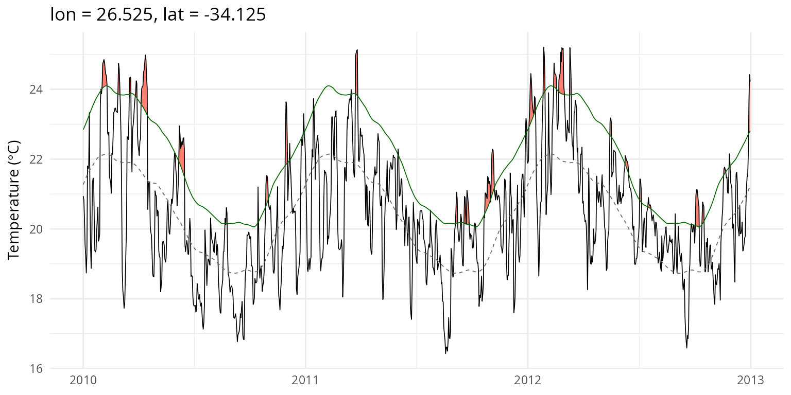
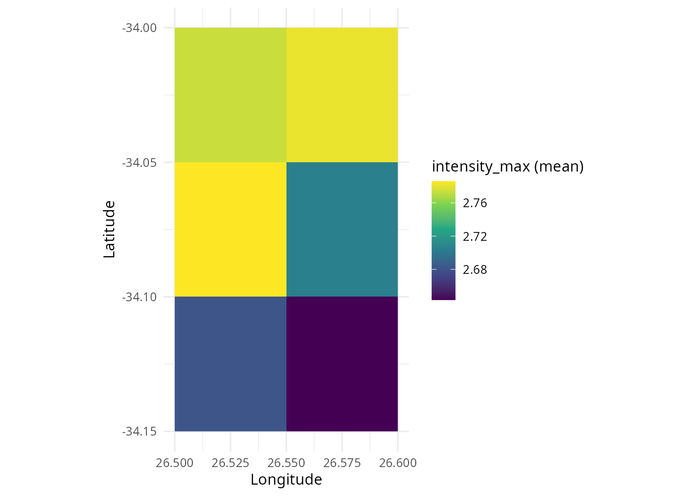

# Getting started with heatwave3

## Introduction

**heatwave3** detects marine heatwaves (MHWs) and cold-spells directly
on gridded NetCDF data using the Hobday et al. (2016, 2018) definition.
All core algorithms are implemented in C++ with OpenMP parallelism,
making it orders of magnitude faster than per-pixel processing with
heatwaveR.

The typical workflow has three steps:

1.  [`ts2clm3()`](https://robwschlegel.github.io/heatwave3/index.html/reference/ts2clm3.md),
    to compute seasonal and threshold climatologies
2.  [`detect_event3()`](https://robwschlegel.github.io/heatwave3/index.html/reference/detect_event3.md),
    to detect events from the climatologies
3.  Analyse/visualise with
    [`category3()`](https://robwschlegel.github.io/heatwave3/index.html/reference/category3.md),
    [`block_average3()`](https://robwschlegel.github.io/heatwave3/index.html/reference/block_average3.md),
    [`detect_blob3()`](https://robwschlegel.github.io/heatwave3/index.html/reference/detect_blob3.md),
    or the plotting functions

## Data input

heatwave3 accepts three kinds of SST input:

- **A single multi-timestep NetCDF file** (such as a merged time series)
- **A vector of daily NetCDF file paths**
- **A directory** containing daily `.nc` or `.nc4` files

NetCDF variable and dimension names are auto-detected using CF
conventions (`axis`, `standard_name`, `units` attributes) and common
naming patterns. This means the package works with GHRSST, OISST, OSTIA,
ERA5, CMIP6, and other datasets without needing to specify dimension
names.

``` r

library(heatwave3)

# Single multi-timestep file. 'name' is a path stem; ts2clm3() writes
# <name>_clim.nc.
sst_file <- "/path/to/sst_merged.nc"
ts2clm3(file_in = sst_file,
        name = "benguela",
        climatologyPeriod = c("1982-01-01", "2011-12-31"),
        lon_range = c(15, 35), lat_range = c(-38, -28),
        n_threads = 4)

# Directory of daily files
ts2clm3(file_in = "/path/to/daily_sst/",
        name = "benguela",
        climatologyPeriod = c("1982-01-01", "2011-12-31"),
        n_threads = 4)

# Explicit vector of file paths
daily_files <- list.files("/path/to/daily/", pattern = "[.]nc4$",
                          full.names = TRUE)
ts2clm3(file_in = daily_files,
        name = "benguela",
        climatologyPeriod = c("1982-01-01", "2011-12-31"),
        n_threads = 4)
```

## Basic pipeline

Here we show the full pipeline using the bundled OSTIA test dataset (3×2
pixels off the Agulhas coast, 1982–2021, 40 years of daily SST).

``` r

library(heatwave3)

sst_file <- system.file("extdata/sst_test.nc", package = "heatwave3")
stem <- file.path(tempdir(), "demo")

# All-in-one: climatology + event detection. A single 'name' stem produces
# demo_clim.nc and demo_events.nc.
detect3(file_in = sst_file,
        name = stem,
        climatologyPeriod = c("1982-01-01", "2011-12-31"),
        n_threads = 2)
#> Reading SST data from /tmp/RtmptnP3kw/temp_libpath10f40785ac7f0/heatwave3/extdata/sst_test.nc...
#> Grid: 2 lon x 3 lat x 14276 time = 6 pixels
#> Computing climatology with 2 thread(s)...
#>   6/6 pixels (100%)
#> Writing climatology to /tmp/RtmpiiHHmB/demo_clim.nc...
#> Done.
#> 
#> ------------------------------------------------------------------
#> Climatology written to: /tmp/RtmpiiHHmB/demo_clim.nc
#> Rows (long format): 2,196   grid: 2 lon x 3 lat
#> 
#> Head:
#>      lon     lat doy     seas   thresh
#> 1 26.525 -34.125   1 294.4208 295.9951
#> 2 26.525 -34.125   2 294.4648 296.0311
#> 3 26.525 -34.125   3 294.5088 296.0720
#> 4 26.525 -34.125   4 294.5524 296.1133
#> 5 26.525 -34.125   5 294.5955 296.1553
#> 
#> Tail:
#>         lon     lat doy     seas   thresh
#> 2192 26.575 -34.025 362 293.5308 295.1848
#> 2193 26.575 -34.025 363 293.5672 295.2141
#> 2194 26.575 -34.025 364 293.6065 295.2460
#> 2195 26.575 -34.025 365 293.6480 295.2776
#> 2196 26.575 -34.025 366 293.6907 295.3100
#> 
#> Summary:
#>   ocean pixels (valid climatology): 6
#>   seas:   291.1 to 295.6
#>   thresh: 292.4 to 297.6
#> 
#> Examine with  hw3_export("/tmp/RtmpiiHHmB/demo_clim.nc", n = 20)
#> or export with hw3_export("/tmp/RtmpiiHHmB/demo_clim.nc", file_out = "out.csv")  (.csv/.rds/.parquet)
#> ------------------------------------------------------------------
#> Reading climatology from /tmp/RtmpiiHHmB/demo_clim.nc...
#> Reading SST data from /tmp/RtmptnP3kw/temp_libpath10f40785ac7f0/heatwave3/extdata/sst_test.nc...
#> Grid: 2 lon x 3 lat x 14276 time = 6 pixels
#> Detecting events with 2 thread(s)...
#>   6/6 pixels (100%)
#> Found 610 events across 6 pixels
#> Writing events to /tmp/RtmpiiHHmB/demo_events.nc...
#> Done.
#> 
#> ------------------------------------------------------------------
#> Events written to: /tmp/RtmpiiHHmB/demo_events.nc
#> Rows (long format): 610
#> 
#> Head:
#>      lon     lat pixel_index event_no date_start  date_peak   date_end duration
#> 1 26.525 -34.125           0        1 1982-11-06 1982-11-14 1982-11-24       19
#> 2 26.525 -34.125           0        2 1983-04-19 1983-04-20 1983-04-23        5
#> 3 26.525 -34.125           0        3 1983-05-27 1983-05-30 1983-06-01        6
#> 4 26.525 -34.125           0        4 1983-06-24 1983-06-25 1983-06-30        7
#> 5 26.525 -34.125           0        5 1983-07-10 1983-07-12 1983-07-15        6
#>   intensity_mean intensity_max intensity_var intensity_cumulative
#> 1         2.2099        3.1531        0.5616              41.9874
#> 2         3.4849        3.6150        0.1535              17.4243
#> 3         1.9696        2.0416        0.0668              11.8179
#> 4         1.9655        2.4626        0.3339              13.7587
#> 5         1.5890        1.8050        0.1784               9.5342
#>   intensity_mean_relThresh intensity_max_relThresh intensity_var_relThresh
#> 1                   0.6780                  1.6275                  0.5667
#> 2                   1.6822                  1.8107                  0.1481
#> 3                   0.2178                  0.2885                  0.0702
#> 4                   0.5567                  1.0416                  0.3225
#> 5                   0.2596                  0.4747                  0.1772
#>   intensity_cumulative_relThresh intensity_mean_abs intensity_max_abs
#> 1                        12.8813           295.2789            296.22
#> 2                         8.4110           297.9640            298.10
#> 3                         1.3069           295.6150            295.67
#> 4                         3.8969           294.7100            295.27
#> 5                         1.5575           294.0717            294.29
#>   intensity_var_abs intensity_cumulative_abs rate_onset rate_decline
#> 1            0.5886                  5610.30     0.1840       0.1471
#> 2            0.1573                  1489.82     0.1007       0.0349
#> 3            0.0677                  1773.69     0.0303       0.0282
#> 4            0.3945                  2062.97     0.2077       0.1885
#> 5            0.1824                  1764.43     0.1363       0.1270
#> 
#> Tail:
#>        lon     lat pixel_index event_no date_start  date_peak   date_end
#> 606 26.575 -34.025           5       98 2019-07-07 2019-07-11 2019-07-14
#> 607 26.575 -34.025           5       99 2019-08-30 2019-09-02 2019-09-05
#> 608 26.575 -34.025           5      100 2019-10-21 2019-10-26 2019-11-01
#> 609 26.575 -34.025           5      101 2020-07-05 2020-07-06 2020-07-09
#> 610 26.575 -34.025           5      102 2020-08-24 2020-08-25 2020-08-30
#>     duration intensity_mean intensity_max intensity_var intensity_cumulative
#> 606        8         1.9123        2.6167        0.3509              15.2983
#> 607        7         2.6135        3.2218        0.6238              18.2944
#> 608       12         2.7097        4.2806        0.9613              32.5162
#> 609        5         1.9184        2.4610        0.4567               9.5918
#> 610        7         1.7027        1.8887        0.1673              11.9191
#>     intensity_mean_relThresh intensity_max_relThresh intensity_var_relThresh
#> 606                   0.5331                  1.2395                  0.3545
#> 607                   1.2196                  1.8291                  0.6356
#> 608                   1.2481                  2.8252                  0.9574
#> 609                   0.5193                  1.0566                  0.4505
#> 610                   0.3486                  0.5476                  0.1719
#>     intensity_cumulative_relThresh intensity_mean_abs intensity_max_abs
#> 606                         4.2646           293.7725            294.47
#> 607                         8.5369           293.8743            294.48
#> 608                        14.9767           294.3308            295.87
#> 609                         2.5966           293.8140            294.37
#> 610                         2.4402           292.9757            293.17
#>     intensity_var_abs intensity_cumulative_abs rate_onset rate_decline
#> 606            0.3438                  2350.18     0.2090       0.1836
#> 607            0.6214                  2057.12     0.2155       0.5020
#> 608            0.9940                  3531.97     0.5195       0.4084
#> 609            0.4723                  1469.07     0.3247       0.2915
#> 610            0.1695                  2050.83     0.2322       0.0693
#> 
#> Summary:
#>   events: 610   pixels with events: 6
#>   dates:  1982-11-06 to 2020-09-26
#>   duration (days):     5 to    38
#>   intensity_max:   1.314 to 4.911
#> 
#> Examine with  hw3_export("/tmp/RtmpiiHHmB/demo_events.nc", n = 20)
#> or export with hw3_export("/tmp/RtmpiiHHmB/demo_events.nc", file_out = "out.csv")  (.csv/.rds/.parquet)
#> ------------------------------------------------------------------

# The two products follow the naming convention <name>_clim.nc / <name>_events.nc
clim_file  <- paste0(stem, "_clim.nc")
event_file <- paste0(stem, "_events.nc")
```

## Per-pixel time series plot

Extract a single pixel and produce a heatwaveR-style event line plot
with flame polygons showing events above the threshold.

``` r

event_line3(sst_file = sst_file,
            clim_file = clim_file,
            lon = 26.525, lat = -34.125,
            start_date = "2010-01-01",
            end_date = "2012-12-31")
```



## Spatial maps

Visualise the spatial distribution of any event metric across the grid.

``` r

plot_metric3(event_file, metric = "intensity_max", summary = "mean")
```



## Event categories and yearly aggregation

``` r

cats <- category3(event_file, clim_file)
head(cats)
#>   event_no    lon     lat  peak_date category intensity_max duration p_moderate
#> 1        1 26.525 -34.125 1982-11-14     <NA>        3.1531       19          0
#> 2        2 26.525 -34.125 1983-04-20     <NA>        3.6150        5          0
#> 3        3 26.525 -34.125 1983-05-30     <NA>        2.0416        6          0
#> 4        4 26.525 -34.125 1983-06-25     <NA>        2.4626        7          0
#> 5        5 26.525 -34.125 1983-07-12     <NA>        1.8050        6          0
#> 6        6 26.525 -34.125 1983-07-21     <NA>        1.9993        7          0
#>   p_strong p_severe p_extreme season
#> 1        0        0         0       
#> 2        0        0         0       
#> 3        0        0         0       
#> 4        0        0         0       
#> 5        0        0         0       
#> 6        0        0         0
table(cats$category)
#> < table of extent 0 >
```

``` r

ba <- block_average3(event_file)
head(ba)
#>      lon     lat year count duration_mean duration_max intensity_mean
#> 1 26.525 -34.125 1982     1      19.00000           19       2.209900
#> 2 26.525 -34.125 1983     5       6.20000            7       2.130060
#> 3 26.525 -34.125 1984     2       7.00000            9       2.016500
#> 4 26.525 -34.125 1985     2       5.00000            5       1.632900
#> 5 26.525 -34.125 1986     5       8.40000           14       2.530060
#> 6 26.525 -34.125 1987     3      11.66667           15       2.399233
#>   intensity_max_mean intensity_max_max intensity_cumulative_mean total_days
#> 1           3.153100            3.1531                  41.98740         19
#> 2           2.384700            3.6150                  12.80478         31
#> 3           2.448550            2.7094                  13.67920         14
#> 4           1.723400            1.9355                   8.16455         10
#> 5           3.153800            3.8774                  21.01420         42
#> 6           2.840733            3.1123                  28.25203         35
#>   total_icum
#> 1    41.9874
#> 2    64.0239
#> 3    27.3584
#> 4    16.3291
#> 5   105.0710
#> 6    84.7561
```

## Detrended climatology

By default,
[`ts2clm3()`](https://robwschlegel.github.io/heatwave3/index.html/reference/ts2clm3.md)
follows Hobday et al. (2016) with a fixed baseline. To remove the
long-term warming trend before computing the climatology (following
Jacox et al. 2020), set `detrend = TRUE`:

``` r

ts2clm3(file_in = sst_file,
        name = "benguela_detrended",
        climatologyPeriod = c("1982-01-01", "2011-12-31"),
        detrend = TRUE)
```

## Output formats

The compute functions always write their native NetCDF. To read a
product into R, or export it to CSV/RDS/Parquet, use
[`hw3_export()`](https://robwschlegel.github.io/heatwave3/index.html/reference/hw3_export.md),
which auto-detects the product type:

``` r

# Read the events back as a data.frame (whole, or a quick preview with n =)
events <- hw3_export("benguela_events.nc")
head(hw3_export("benguela_events.nc", n = 20))

# Export to flat files (format chosen by the extension)
hw3_export("benguela_events.nc", file_out = "events.csv")
hw3_export("benguela_clim.nc",   file_out = "clim.parquet")
```

## Cold spells

Detect marine cold-spells by setting `pctile = 10` for the climatology
and `coldSpells = TRUE` for detection.

``` r

ts2clm3(file_in = sst_file,
        name = "benguela_cold",
        climatologyPeriod = c("1982-01-01", "2011-12-31"),
        pctile = 10, n_threads = 2)

detect_event3(file_in = sst_file,
              name = "benguela_cold",
              coldSpells = TRUE, n_threads = 2)
```

## Spatial blob detection

The examples below reproduce the spatial blob analysis from Schlegel et
al., using the OSTIA dataset covering the South African coast (15–35°E,
28–38°S). They show heatwave blob footprints, daily area evolution,
centroid trajectories, persistence maps, and the cold-spell equivalents.

All six figure types correspond to the example outputs in
`heatwaveR/dev_doc/figs/`.

### Setup: climatology and blob detection

``` r

library(heatwave3)
library(ggplot2)

sst_file <- "/Volumes/OceanData/OSTIA_East_Coast_MHW/SWIO_Jan1982-Dec2021.nc"
xlim <- c(15, 35); ylim <- c(-38, -28)

clim_file <- ts2clm3(file_in = sst_file,
        name = file.path(tempdir(), "swio"),
        climatologyPeriod = c("1982-01-01", "2011-12-31"),
        lon_range = xlim, lat_range = ylim,
        var_name = "analysed_sst",
        n_threads = 4)

# Detect spatial blobs, including voxel data for footprint maps
blobs <- detect_blob3(file_in = sst_file,
                      clim_file = clim_file,
                      var_name = "analysed_sst",
                      minVoxels = 200L,
                      topN = 10L,
                      rankBy = "cumI_km2_day",
                      return = c("event", "daily", "voxel"))

# Coastline for map overlays
land <- rnaturalearth::ne_countries(scale = "medium", returnclass = "sf")
land_clip <- sf::st_crop(land, xmin = xlim[1], xmax = xlim[2],
                         ymin = ylim[1], ymax = ylim[2])
```

### Figure 1: Top 6 blob peak-day footprints

``` r

top6 <- blobs$event[1:6, ]
top6$blob_lbl <- paste0("#", top6$rank, " | ", top6$date_peak)
vox6 <- blobs$voxel[blobs$voxel$blob %in% top6$blob, ]
vox6$blob_lbl <- top6$blob_lbl[match(vox6$blob, top6$blob)]

# Filter to peak date for each blob
vox6_peak <- do.call(rbind, lapply(split(vox6, vox6$blob), function(sub) {
  peak <- top6$date_peak[top6$blob == sub$blob[1]]
  sub[sub$date == peak, ]
}))

ggplot() +
  geom_sf(data = land_clip, fill = "grey92", colour = "grey60", linewidth = 0.2) +
  geom_raster(data = vox6_peak, aes(lon, lat, fill = delta)) +
  scale_fill_viridis_c(name = expression(Delta ~ "(K)"),
                       option = "inferno", direction = 1) +
  facet_wrap(~ blob_lbl, ncol = 3) +
  coord_sf(xlim = xlim, ylim = ylim, expand = FALSE) +
  labs(title = "OSTIA spatial heatwave blobs: top 6 by |cumI|, peak-day footprints",
       subtitle = "Region 15-35 E, 38-28 S",
       x = "Longitude", y = "Latitude") +
  theme_minimal(base_size = 10) +
  theme(strip.text = element_text(face = "bold"))
```

### Figure 2: Daily area of top 6 blobs

``` r

daily6 <- blobs$daily[blobs$daily$blob %in% top6$blob, ]
daily6$blob_lbl <- factor(top6$blob_lbl[match(daily6$blob, top6$blob)],
                          levels = top6$blob_lbl)

ggplot(daily6, aes(date, area_km2 / 1000, colour = blob_lbl)) +
  geom_line(linewidth = 0.8) +
  scale_colour_viridis_d(name = "rank", option = "turbo") +
  labs(title = "Daily area of top 6 spatial heatwave blobs",
       x = NULL, y = expression(Area ~ (10^3 ~ km^2))) +
  theme_minimal(base_size = 11)
```

### Figure 3: Centroid trajectories of top 3 blobs

``` r

top3 <- blobs$event[1:3, ]
top3$blob_lbl <- paste0("#", top3$rank, " (", top3$date_peak, ")")
daily3 <- blobs$daily[blobs$daily$blob %in% top3$blob, ]
daily3$blob_lbl <- factor(top3$blob_lbl[match(daily3$blob, top3$blob)],
                          levels = top3$blob_lbl)

for (b in unique(daily3$blob)) {
  idx <- daily3$blob == b
  daily3$day_from_start[idx] <- as.numeric(
    daily3$date[idx] - min(daily3$date[idx])
  )
}

ggplot() +
  geom_sf(data = land_clip, fill = "grey92", colour = "grey60", linewidth = 0.2) +
  geom_path(data = daily3, aes(centroid_lon, centroid_lat,
                                colour = day_from_start), linewidth = 0.6) +
  geom_point(data = daily3, aes(centroid_lon, centroid_lat,
                                 colour = day_from_start,
                                 size = area_km2 / 1000), alpha = 0.7) +
  scale_colour_viridis_c(name = "day from start") +
  scale_size_continuous(name = expression(Area ~ (10^3 ~ km^2)),
                        range = c(0.5, 5)) +
  facet_wrap(~ blob_lbl, ncol = 3) +
  coord_sf(xlim = xlim, ylim = ylim, expand = FALSE) +
  labs(title = "Centroid trajectories of top 3 blobs",
       x = "Longitude", y = "Latitude") +
  theme_minimal(base_size = 10)
```

### Figure 4: Persistence, days under heatwave per pixel

``` r

vox3 <- blobs$voxel[blobs$voxel$blob %in% top3$blob, ]
vox3$blob_lbl <- factor(top3$blob_lbl[match(vox3$blob, top3$blob)],
                        levels = top3$blob_lbl)

# Count days per (blob, lon, lat)
vox3_persist <- aggregate(date ~ blob_lbl + lon + lat, data = vox3,
                          FUN = length)
names(vox3_persist)[4] <- "n_days"

ggplot() +
  geom_sf(data = land_clip, fill = "grey92", colour = "grey60", linewidth = 0.2) +
  geom_raster(data = vox3_persist, aes(lon, lat, fill = n_days)) +
  scale_fill_viridis_c(name = "days under event", option = "plasma") +
  facet_wrap(~ blob_lbl, ncol = 3) +
  coord_sf(xlim = xlim, ylim = ylim, expand = FALSE) +
  labs(title = "Footprint persistence: days under heatwave per pixel, top 3 blobs",
       x = "Longitude", y = "Latitude") +
  theme_minimal(base_size = 10)
```

### Figure 5: Cold-spell blob footprints

``` r

clim_cold <- ts2clm3(file_in = sst_file,
        name = file.path(tempdir(), "swio_cold"),
        climatologyPeriod = c("1982-01-01", "2011-12-31"),
        lon_range = xlim, lat_range = ylim,
        var_name = "analysed_sst",
        pctile = 10, n_threads = 4)

mcs_blobs <- detect_blob3(file_in = sst_file,
                          clim_file = clim_cold,
                          var_name = "analysed_sst",
                          coldSpells = TRUE,
                          minVoxels = 200L,
                          topN = 10L,
                          rankBy = "cumI_km2_day",
                          return = c("event", "daily", "voxel"))
```

``` r

mcs6 <- mcs_blobs$event[1:6, ]
mcs6$blob_lbl <- paste0("#", mcs6$rank, " | ", mcs6$date_peak)
mvox6 <- mcs_blobs$voxel[mcs_blobs$voxel$blob %in% mcs6$blob, ]
mvox6$blob_lbl <- mcs6$blob_lbl[match(mvox6$blob, mcs6$blob)]

mvox6_peak <- do.call(rbind, lapply(split(mvox6, mvox6$blob), function(sub) {
  peak <- mcs6$date_peak[mcs6$blob == sub$blob[1]]
  sub[sub$date == peak, ]
}))
mvox6_peak$delta <- -mvox6_peak$delta  # show negative anomalies

ggplot() +
  geom_sf(data = land_clip, fill = "grey92", colour = "grey60", linewidth = 0.2) +
  geom_raster(data = mvox6_peak, aes(lon, lat, fill = delta)) +
  scale_fill_viridis_c(name = expression(Delta ~ "(K)"),
                       option = "mako", direction = 1) +
  facet_wrap(~ blob_lbl, ncol = 3) +
  coord_sf(xlim = xlim, ylim = ylim, expand = FALSE) +
  labs(title = "OSTIA cold-spell blobs: top 6 by |cumI|, peak-day footprints",
       subtitle = "Region 15-35 E, 38-28 S",
       x = "Longitude", y = "Latitude") +
  theme_minimal(base_size = 10) +
  theme(strip.text = element_text(face = "bold"))
```

### Figure 6: Cold-spell daily area

``` r

mdaily6 <- mcs_blobs$daily[mcs_blobs$daily$blob %in% mcs6$blob, ]
mdaily6$blob_lbl <- factor(mcs6$blob_lbl[match(mdaily6$blob, mcs6$blob)],
                           levels = mcs6$blob_lbl)

ggplot(mdaily6, aes(date, area_km2 / 1000, colour = blob_lbl)) +
  geom_line(linewidth = 0.8) +
  scale_colour_viridis_d(name = "rank", option = "mako") +
  labs(title = "Daily area of top 6 spatial cold-spell blobs",
       x = NULL, y = expression(Area ~ (10^3 ~ km^2))) +
  theme_minimal(base_size = 11)
```

## Performance

heatwave3 runs much faster than per-pixel processing with heatwaveR. On
a 20×20 grid (400 pixels, 14,276 daily time steps each):

| Method                         | Time       | Speedup     |
|--------------------------------|------------|-------------|
| heatwaveR (serial, 400 pixels) | ca. 38 sec | 1×          |
| heatwave3 (4 threads)          | 0.53 sec   | **ca. 71×** |

The speedup comes from:

1.  **C++ implementation** of all core algorithms (climatology + event
    detection)
2.  **OpenMP parallelism** across pixels
3.  **Direct NetCDF I/O** via libnetcdf (no R overhead)
